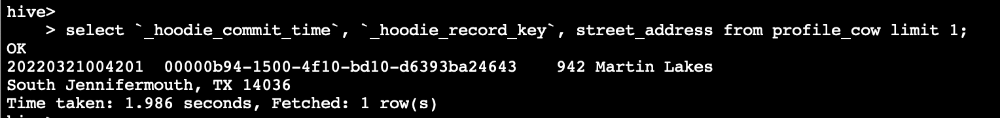

# ** Exercise 4 - Apache Hudi on Amazon EMR **

In this exercise you will build incremental data lakes on EMR using Apache Hudi. You can build data lakes using Apache Hudi using Spark Datasource APIs, Hudi Deltastreamer utility and SparkSQL.  

In the previous EMR Studio exercise, we linked the Git repository in the Jupyter interface. We will continue to use the same repository to run these exercises.

SSH into the EMR leader node of the cluster "EMR-Spark-Hive-Presto" or open a session using AWS Session Manager for the EMR leader node since we will be running a few commands directly on the leader node.

### Apache Hudi with Spark Datasource APIs

Open the file workshop-repo -> files -> notebook -> apache-hudi-on-amazon-emr-datasource-pyspark-demo.ipynb in the Jupyter. Make sure the Kernel is set to PySpark.


All the instructions required to run the notebook are within the notebook itself.

Download the file workshop-repo -> schema -> schema.avsc to your local desktop and upload this file into the following S3 location (replace "youraccountID" with your event engine AWS account ID): *s3://mrworkshop-youraccountID-dayone/schema/schema.avsc*


Alternatively, you can run the following commands from the leader node of your EMR cluster. Replace "youraccountID" with your event engine AWS account ID. We will be using this schema AVRO file to run compaction on Merge-On-Read tables.

```
sudo su hadoop
cd ~
curl -o schema.avsc https://raw.githubusercontent.com/vasveena/amazon-emr-ttt-workshop/main/files/schema/schema.avsc
aws s3 cp schema.avsc s3://mrworkshop-youraccountID-dayone/schema/schema.avsc
```

Run the blocks of the notebook "apache-hudi-on-amazon-emr-datasource-pyspark-demo.ipynb". Replace "youraccountID" in the S3 paths within the notebook with your AWS event engine account ID.

### Apache Hudi with Spark Deltastreamer

Hudi provides a utility called Deltastreamer for creating and manipulating Hudi datasets without the need to write any Spark code. For this activity, let us copy a few files to the S3 location. Run the following commands in your EMR leader node session created using Session Manager or SSH.

```
sudo su hadoop
cd ~
curl -o source-schema-json.avsc https://raw.githubusercontent.com/vasveena/amazon-emr-ttt-workshop/main/files/schema/source-schema-json.avsc
curl -o target-schema-json.avsc https://raw.githubusercontent.com/vasveena/amazon-emr-ttt-workshop/main/files/schema/target-schema-json.avsc
curl -o json-deltastreamer.properties https://raw.githubusercontent.com/vasveena/amazon-emr-ttt-workshop/main/files/properties/json-deltastreamer.properties
curl -o json-deltastreamer_upsert.properties https://raw.githubusercontent.com/vasveena/amazon-emr-ttt-workshop/main/files/properties/json-deltastreamer_upsert.properties
curl -o apache-hudi-on-amazon-emr-deltastreamer-python-demo.py https://raw.githubusercontent.com/vasveena/amazon-emr-ttt-workshop/main/files/script/apache-hudi-on-amazon-emr-deltastreamer-python-demo.py
```

Replace youraccountID with event engine AWS account ID in the files json-deltastreamer.properties, json-deltastreamer_upsert.properties and apache-hudi-on-amazon-emr-deltastreamer-python-demo.py. You can do so using sed command below. Replace 707263692290 with your event engine account ID.

```
sed -i 's|youraccountID|707263692290|g' json-deltastreamer.properties
sed -i 's|youraccountID|707263692290|g' json-deltastreamer_upsert.properties
sed -i 's|youraccountID|707263692290|g' apache-hudi-on-amazon-emr-deltastreamer-python-demo.py
```

Now, copy the four files to your S3 location. Replace youraccountID with event engine AWS account ID.

```
aws s3 cp source-schema-json.avsc s3://mrworkshop-youraccountID-dayone/hudi-ds/config/
aws s3 cp target-schema-json.avsc s3://mrworkshop-youraccountID-dayone/hudi-ds/config/
aws s3 cp json-deltastreamer.properties s3://mrworkshop-youraccountID-dayone/hudi-ds/config/
aws s3 cp json-deltastreamer_upsert.properties s3://mrworkshop-youraccountID-dayone/hudi-ds/config/

```

Now let's generate some Fake data for the purpose of this workshop. We will use [Faker](https://faker.readthedocs.io/en/master/) library for that. Install Faker with the below command.

```
pip3 install Faker
pip3 install boto3

```

Run the Python program to generate Fake data under respective S3 locations. This takes a few minutes to complete.

```
python3 apache-hudi-on-amazon-emr-deltastreamer-python-demo.py
```

Once done, make sure the inputdata and update prefixes are populated with JSON data files. You can copy one file using “aws s3 cp” on the EMR leader node session to inspect the data. Replace youraccountID with event engine AWS account ID.

```
aws s3 ls s3://mrworkshop-youraccountID-dayone/hudi-ds/inputdata
aws s3 ls s3://mrworkshop-youraccountID-dayone/hudi-ds/updates
```


Copy the Hudi utilities bundle to HDFS.

```
hadoop fs -copyFromLocal /usr/lib/hudi/hudi-utilities-bundle.jar hdfs:///user/hadoop/

```

Let's submit DeltaStreamer step to the EMR cluster. You can submit this step on EC2 JumpHost or leader node of EMR cluster "EMR-Spark-Hive-Presto". Since we have the EMR leader node session active, let us use it to run the command.

Modify Add Steps Command for Bulk Insert Operation. Change the --cluster-id's value to your EMR cluster "EMR-Spark-Hive-Presto" cluster ID (Obtained from AWS Management Console -> Amazon EMR Console -> EMR-Spark-Hive-Presto -> Summary tab. Looks like j-XXXXXXXXX). Replace youraccountID with event engine AWS account ID.

```
aws emr add-steps --cluster-id j-XXXXXXXXX --steps Type=Spark,Name="Deltastreamer COW - Bulk Insert",ActionOnFailure=CONTINUE,Args=[--jars,hdfs:///user/hadoop/*.jar,--class,org.apache.hudi.utilities.deltastreamer.HoodieDeltaStreamer,hdfs:///user/hadoop/hudi-utilities-bundle.jar,--props,s3://mrworkshop-youraccountID-dayone/hudi-ds/config/json-deltastreamer.properties,--table-type,COPY_ON_WRITE,--source-class,org.apache.hudi.utilities.sources.JsonDFSSource,--source-ordering-field,ts,--target-base-path,s3://mrworkshop-707263692290-dayone/hudi-ds-output/person-profile-out1,--target-table,person_profile_cow,--schemaprovider-class,org.apache.hudi.utilities.schema.FilebasedSchemaProvider,--op,BULK_INSERT] --region us-east-1
```


You will get an EMR Step ID in return. You will see the corresponding Hudi Deltastreamer step being submitted to your cluster (AWS Management Console -> Amazon EMR Console -> EMR-Spark-Hive-Presto -> Steps). It will take about 2 minutes to complete.


Check the S3 location for Hudi files. Replace youraccountID with event engine AWS account ID.

```
aws s3 ls s3://mrworkshop-youraccountID-dayone/hudi-ds-output/person-profile-out1/
```


Let's go to the hive CLI on EMR leader node by typing "hive". Let's run the following command to create a table. Replace youraccountID with event engine AWS account ID.

```
CREATE EXTERNAL TABLE `profile_cow`(
  `_hoodie_commit_time` string,
  `_hoodie_commit_seqno` string,
  `_hoodie_record_key` string,
  `_hoodie_partition_path` string,
  `_hoodie_file_name` string,
  `Name` string,
  `phone` string,
  `job` string,
  `company` string,
  `ssn` string,
  `street_address` string,
  `dob` string,
  `email` string,
  `ts` string)
ROW FORMAT SERDE
  'org.apache.hadoop.hive.ql.io.parquet.serde.ParquetHiveSerDe'
STORED AS INPUTFORMAT
  'org.apache.hudi.hadoop.HoodieParquetInputFormat'
OUTPUTFORMAT
  'org.apache.hadoop.hive.ql.io.parquet.MapredParquetOutputFormat'
LOCATION
  's3://mrworkshop-youraccountID-dayone/hudi-ds-output/person-profile-out1/';
```

Select a record from this table and copy the value of hoodie_record_key and street_address to a notepad.

```
select `_hoodie_commit_time`, `_hoodie_record_key`, street_address from profile_cow limit 1;
```



Exit from hive.

```
exit;
```

Now, let's do upsert operation with Hudi Deltastreamer. Change the --cluster-id's value to your EMR cluster "EMR-Spark-Hive-Presto" cluster ID (Obtained from AWS Management Console -> Amazon EMR Console -> EMR-Spark-Hive-Presto -> Summary tab. Looks like j-XXXXXXXXX). Replace youraccountID with event engine AWS account ID.

```
aws emr add-steps --cluster-id j-XXXXXXXXX --steps Type=Spark,Name="Deltastreamer COW - Upsert",ActionOnFailure=CONTINUE,Args=[--jars,hdfs:///user/hadoop/*.jar,--class,org.apache.hudi.utilities.deltastreamer.HoodieDeltaStreamer,hdfs:///user/hadoop/hudi-utilities-bundle.jar,--props,s3://mrworkshop-youraccountID-dayone/hudi-ds/config/json-deltastreamer_upsert.properties,--table-type,COPY_ON_WRITE,--source-class,org.apache.hudi.utilities.sources.JsonDFSSource,--source-ordering-field,ts,--target-base-path,s3://mrworkshop-youraccountID-dayone/hudi-ds-output/person-profile-out1,--target-table,person_profile_cow,--schemaprovider-class,org.apache.hudi.utilities.schema.FilebasedSchemaProvider,--op,UPSERT] --region us-east-1
```


You will get an EMR Step ID in return. You will see the corresponding Hudi Deltastreamer step being submitted to your cluster (AWS Management Console -> Amazon EMR Console -> EMR-Spark-Hive-Presto -> Steps). Wait for the step to complete (~1 minute).


Let us check the street_address for the same _hoodie_record_key. Run the following query in hive CLI on the EMR leader node. Replace value of "_hoodie_record_key" in the where clause with the one you obtained from previous select query. 

```
select `_hoodie_commit_time`, street_address from profile_cow where `_hoodie_record_key`='00000b94-1500-4f10-bd10-d6393ba24643';
```

Notice the change in commit time and street_address.


