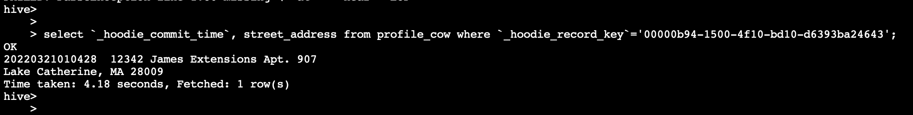

# ** Exercise 4 - Apache Hudi on Amazon EMR **

In this exercise you will build incremental data lakes on EMR using Apache Hudi. You can build data lakes using Apache Hudi using Spark Datasource APIs, Hudi Deltastreamer utility and SparkSQL.  

In the previous EMR Studio exercise, we linked the Git repository in the Jupyter interface. We will continue to use the same repository to run these exercises.

SSH into the EMR leader node of the cluster "EMR-Spark-Hive-Presto" or open a session using AWS Session Manager for the EMR leader node since we will be running a few commands directly on the leader node.

### Apache Hudi with Spark Datasource APIs

Open the file workshop-repo -> files -> notebook -> apache-hudi-on-amazon-emr-datasource-pyspark-demo.ipynb in the Jupyter. Make sure the Kernel is set to PySpark.


All the instructions required to run the notebook are within the notebook itself.

Download the file workshop-repo -> schema -> schema.avsc to your local desktop and upload this file into the following S3 location (replace "youraccountID" with your event engine AWS account ID): *s3://mrworkshop-youraccountID-dayone/schema/schema.avsc*


Alternatively, you can run the following commands from the leader node of your EMR cluster. Replace "youraccountID" with your event engine AWS account ID. We will be using this schema AVRO file to run compaction on Merge-On-Read tables.

```
sudo su hadoop
cd ~
curl -o schema.avsc https://raw.githubusercontent.com/vasveena/amazon-emr-ttt-workshop/main/files/schema/schema.avsc
aws s3 cp schema.avsc s3://mrworkshop-youraccountID-dayone/schema/schema.avsc
```

Run the blocks of the notebook "apache-hudi-on-amazon-emr-datasource-pyspark-demo.ipynb". Replace "youraccountID" in the S3 paths within the notebook with your AWS event engine account ID.

### Apache Hudi with Spark Deltastreamer

Hudi provides a utility called Deltastreamer for creating and manipulating Hudi datasets without the need to write any Spark code. For this activity, let us copy a few files to the S3 location. Run the following commands in your EMR leader node session created using Session Manager or SSH.

```
sudo su hadoop
cd ~
curl -o source-schema-json.avsc https://raw.githubusercontent.com/vasveena/amazon-emr-ttt-workshop/main/files/schema/source-schema-json.avsc
curl -o target-schema-json.avsc https://raw.githubusercontent.com/vasveena/amazon-emr-ttt-workshop/main/files/schema/target-schema-json.avsc
curl -o json-deltastreamer.properties https://raw.githubusercontent.com/vasveena/amazon-emr-ttt-workshop/main/files/properties/json-deltastreamer.properties
curl -o json-deltastreamer_upsert.properties https://raw.githubusercontent.com/vasveena/amazon-emr-ttt-workshop/main/files/properties/json-deltastreamer_upsert.properties
curl -o apache-hudi-on-amazon-emr-deltastreamer-python-demo.py https://raw.githubusercontent.com/vasveena/amazon-emr-ttt-workshop/main/files/script/apache-hudi-on-amazon-emr-deltastreamer-python-demo.py
```

Replace youraccountID with event engine AWS account ID in the files json-deltastreamer.properties, json-deltastreamer_upsert.properties and apache-hudi-on-amazon-emr-deltastreamer-python-demo.py. You can do so using sed command below. Replace 707263692290 with your event engine account ID.

```
sed -i 's|youraccountID|707263692290|g' json-deltastreamer.properties
sed -i 's|youraccountID|707263692290|g' json-deltastreamer_upsert.properties
sed -i 's|youraccountID|707263692290|g' apache-hudi-on-amazon-emr-deltastreamer-python-demo.py
```

Now, copy the four files to your S3 location. Replace youraccountID with event engine AWS account ID.

```
aws s3 cp source-schema-json.avsc s3://mrworkshop-youraccountID-dayone/hudi-ds/config/
aws s3 cp target-schema-json.avsc s3://mrworkshop-youraccountID-dayone/hudi-ds/config/
aws s3 cp json-deltastreamer.properties s3://mrworkshop-youraccountID-dayone/hudi-ds/config/
aws s3 cp json-deltastreamer_upsert.properties s3://mrworkshop-youraccountID-dayone/hudi-ds/config/

```

Now let's generate some Fake data for the purpose of this workshop. We will use [Faker](https://faker.readthedocs.io/en/master/) library for that. Install Faker with the below command.

```
pip3 install Faker
pip3 install boto3

```

Run the Python program to generate Fake data under respective S3 locations. This takes a few minutes to complete.

```
python3 apache-hudi-on-amazon-emr-deltastreamer-python-demo.py
```

Once done, make sure the inputdata and update prefixes are populated with JSON data files. You can copy one file using “aws s3 cp” on the EMR leader node session to inspect the data. Replace youraccountID with event engine AWS account ID.

```
aws s3 ls s3://mrworkshop-youraccountID-dayone/hudi-ds/inputdata
aws s3 ls s3://mrworkshop-youraccountID-dayone/hudi-ds/updates
```


Copy the Hudi utilities bundle to HDFS.

```
hadoop fs -copyFromLocal /usr/lib/hudi/hudi-utilities-bundle.jar hdfs:///user/hadoop/

```

Let's submit DeltaStreamer step to the EMR cluster. You can submit this step on EC2 JumpHost or leader node of EMR cluster "EMR-Spark-Hive-Presto". Since we have the EMR leader node session active, let us use it to run the command.

Modify Add Steps Command for Bulk Insert Operation. Change the --cluster-id's value to your EMR cluster "EMR-Spark-Hive-Presto" cluster ID (Obtained from AWS Management Console -> Amazon EMR Console -> EMR-Spark-Hive-Presto -> Summary tab. Looks like j-XXXXXXXXX). Replace youraccountID with event engine AWS account ID.

```
aws emr add-steps --cluster-id j-XXXXXXXXX --steps Type=Spark,Name="Deltastreamer COW - Bulk Insert",ActionOnFailure=CONTINUE,Args=[--jars,hdfs:///user/hadoop/*.jar,--class,org.apache.hudi.utilities.deltastreamer.HoodieDeltaStreamer,hdfs:///user/hadoop/hudi-utilities-bundle.jar,--props,s3://mrworkshop-youraccountID-dayone/hudi-ds/config/json-deltastreamer.properties,--table-type,COPY_ON_WRITE,--source-class,org.apache.hudi.utilities.sources.JsonDFSSource,--source-ordering-field,ts,--target-base-path,s3://mrworkshop-707263692290-dayone/hudi-ds-output/person-profile-out1,--target-table,person_profile_cow,--schemaprovider-class,org.apache.hudi.utilities.schema.FilebasedSchemaProvider,--op,BULK_INSERT] --region us-east-1
```


You will get an EMR Step ID in return. You will see the corresponding Hudi Deltastreamer step being submitted to your cluster (AWS Management Console -> Amazon EMR Console -> EMR-Spark-Hive-Presto -> Steps). It will take about 2 minutes to complete.


Check the S3 location for Hudi files. Replace youraccountID with event engine AWS account ID.

```
aws s3 ls s3://mrworkshop-youraccountID-dayone/hudi-ds-output/person-profile-out1/
```


Let's go to the hive CLI on EMR leader node by typing "hive". Let's run the following command to create a table. Replace youraccountID with event engine AWS account ID.

```
CREATE EXTERNAL TABLE `profile_cow`(
  `_hoodie_commit_time` string,
  `_hoodie_commit_seqno` string,
  `_hoodie_record_key` string,
  `_hoodie_partition_path` string,
  `_hoodie_file_name` string,
  `Name` string,
  `phone` string,
  `job` string,
  `company` string,
  `ssn` string,
  `street_address` string,
  `dob` string,
  `email` string,
  `ts` string)
ROW FORMAT SERDE
  'org.apache.hadoop.hive.ql.io.parquet.serde.ParquetHiveSerDe'
STORED AS INPUTFORMAT
  'org.apache.hudi.hadoop.HoodieParquetInputFormat'
OUTPUTFORMAT
  'org.apache.hadoop.hive.ql.io.parquet.MapredParquetOutputFormat'
LOCATION
  's3://mrworkshop-youraccountID-dayone/hudi-ds-output/person-profile-out1/';
```

Select a record from this table and copy the value of hoodie_record_key and street_address to a notepad.

```
select `_hoodie_commit_time`, `_hoodie_record_key`, street_address from profile_cow limit 1;
```


Exit from hive.

```
exit;
```

Now, let's do upsert operation with Hudi Deltastreamer. Change the --cluster-id's value to your EMR cluster "EMR-Spark-Hive-Presto" cluster ID (Obtained from AWS Management Console -> Amazon EMR Console -> EMR-Spark-Hive-Presto -> Summary tab. Looks like j-XXXXXXXXX). Replace youraccountID with event engine AWS account ID.

```
aws emr add-steps --cluster-id j-XXXXXXXXX --steps Type=Spark,Name="Deltastreamer COW - Upsert",ActionOnFailure=CONTINUE,Args=[--jars,hdfs:///user/hadoop/*.jar,--class,org.apache.hudi.utilities.deltastreamer.HoodieDeltaStreamer,hdfs:///user/hadoop/hudi-utilities-bundle.jar,--props,s3://mrworkshop-youraccountID-dayone/hudi-ds/config/json-deltastreamer_upsert.properties,--table-type,COPY_ON_WRITE,--source-class,org.apache.hudi.utilities.sources.JsonDFSSource,--source-ordering-field,ts,--target-base-path,s3://mrworkshop-youraccountID-dayone/hudi-ds-output/person-profile-out1,--target-table,person_profile_cow,--schemaprovider-class,org.apache.hudi.utilities.schema.FilebasedSchemaProvider,--op,UPSERT] --region us-east-1
```


You will get an EMR Step ID in return. You will see the corresponding Hudi Deltastreamer step being submitted to your cluster (AWS Management Console -> Amazon EMR Console -> EMR-Spark-Hive-Presto -> Steps). Wait for the step to complete (~1 minute).


Let us check the street_address for the same _hoodie_record_key. Run the following query in hive CLI on the EMR leader node. Replace value of "_hoodie_record_key" in the where clause with the one you obtained from previous select query.

```
select `_hoodie_commit_time`, street_address from profile_cow where `_hoodie_record_key`='00000b94-1500-4f10-bd10-d6393ba24643';
```

Notice the change in commit time and street_address.




### Apache Hudi with Spark Structured Streaming

This exercise will show how you can write real time Hudi data sets using Spark Structured Streaming. For this exercise, we will use real-time NYC Metro Subway data using [MTA API](https://api.mta.info/#/landing).

Keep the EMR Session Manager or SSH session active. In a new browser tab, create a new SSM session for EC2 instance "JumpHost" (or SSH into EC2 instance "JumpHost"). i.e., under the [EC2 console](https://console.aws.amazon.com/ec2/home?region=us-east-1#Instances:) select the EC2 instance with name "JumpHost". Click on "Connect" -> Session Manager -> Connect.

Switch to EC2 user and go to home directory

```
sudo su ec2-user
cd ~
```

Run the two commands in EC2 instance to get the values of ZookeeperConnectString and BootstrapBrokerString.

```
clusterArn=`aws kafka list-clusters --region us-east-1 | jq '.ClusterInfoList[0].ClusterArn'`
echo $clusterArn
bs=$(echo "aws kafka get-bootstrap-brokers --cluster-arn ${clusterArn} --region us-east-1"  | bash | jq '.BootstrapBrokerString')
```

Get Zookeeper Connection String to create Kafka topics  

```
zs=$(echo "aws kafka describe-cluster --cluster-arn $clusterArn" --region us-east-1 | bash | jq '.ClusterInfo.ZookeeperConnectString')
```

Create two Kafka topics.

```
echo "/home/ec2-user/kafka/kafka_2.12-2.2.1/bin/kafka-topics.sh --create --zookeeper $zs --replication-factor 3 --partitions 1 --topic trip_update_topic" | bash

echo "/home/ec2-user/kafka/kafka_2.12-2.2.1/bin/kafka-topics.sh --create --zookeeper $zs --replication-factor 3 --partitions 1 --topic trip_status_topic" | bash
```

Export API key on the session

```
export MTA_API_KEY=UskS0iAsK06DtSffbgqNi8hlDvApPR833wydQAHG
```

Install packages required by Kafka client on the JumpHost instance session (via SSH or AWS SSM).

```
pip3 install protobuf
pip3 install kafka-python
pip3 install --upgrade gtfs-realtime-bindings
pip3 install underground
pip3 install pathlib
pip3 install requests
```

Modify the bootstrap servers in the file train_arrival_producer.py on the JumpHost's /home/ec2-user/ directory. Change

```
echo "aws kafka get-bootstrap-brokers --cluster-arn ${clusterArn} --region us-east-1"  | bash | jq '.BootstrapBrokerString'

```


Run the Kafka producer client and terminate the process using Ctrl + C after 10 seconds.

```
python3 train_arrival_producer.py
```

You can verify that the Kafka topics are being written to using the following commands
```
/home/ec2-user/kafka/kafka_2.12-2.2.1/bin/kafka-console-consumer.sh --bootstrap-server "b-3.mskcluster.4ihigb.c20.kafka.us-east-1.amazonaws.com:9092,b-2.mskcluster.4ihigb.c20.kafka.us-east-1.amazonaws.com:9092,b-1.mskcluster.4ihigb.c20.kafka.us-east-1.amazonaws.com:9092" --topic trip_update_topic --from-beginning
```
<Ctrl + C> after a few seconds
```
/home/ec2-user/kafka/kafka_2.12-2.2.1/bin/kafka-console-consumer.sh --bootstrap-server "b-3.mskcluster.4ihigb.c20.kafka.us-east-1.amazonaws.com:9092,b-2.mskcluster.4ihigb.c20.kafka.us-east-1.amazonaws.com:9092,b-1.mskcluster.4ihigb.c20.kafka.us-east-1.amazonaws.com:9092" --topic trip_status_topic --from-beginning
```
<Ctrl + C> after a few seconds

Now let's configure Spark consumer on EMR leader node using Session Manager or SSH. 9). SSH into the leader node of EMR cluster "EMR-Spark-Hive-Presto" (or use AWS Session Manager). Download Spark dependencies in EMR leader node session.

```
sudo su hadoop
cd ~

cd /usr/lib/spark/jars
sudo wget https://repo1.maven.org/maven2/org/apache/spark/spark-streaming-kafka-0-10_2.12/3.0.1/spark-streaming-kafka-0-10_2.12-3.0.1.jar
sudo wget https://repo1.maven.org/maven2/org/apache/spark/spark-sql-kafka-0-10_2.12/3.0.1/spark-sql-kafka-0-10_2.12-3.0.1.jar
sudo wget https://repo1.maven.org/maven2/org/apache/kafka/kafka-clients/2.2.1/kafka-clients-2.2.1.jar
sudo wget https://repo1.maven.org/maven2/org/apache/spark/spark-streaming-kafka-0-10-assembly_2.12/3.0.1/spark-streaming-kafka-0-10-assembly_2.12-3.0.1.jar
sudo wget https://repo1.maven.org/maven2/org/apache/commons/commons-pool2/2.11.1/commons-pool2-2.11.1.jar

```

In same session, provide all access to all HDFS folders. You can scope access per user if desired.

```
hdfs dfs -chmod 777 /
```

Now, open Spark shell using the "spark-shell" command.

```
spark-shell --jars hdfs:///user/hadoop/aws-java-sdk-bundle-1.12.31.jar,hdfs:///user/hadoop/httpcore-4.4.11.jar,hdfs:///user/hadoop/httpclient-4.5.9.jar,hdfs:///user/hadoop/hudi-spark-bundle.jar,hdfs:///user/hadoop/spark-avro.jar --conf spark.sql.hive.convertMetastoreParquet=false --conf spark.serializer=org.apache.spark.serializer.KryoSerializer
```

Once the Spark session is created, run the below code block. Replace youraccountID with event engine AWS account ID. Replace "broker" variable's value with your bootstrap string.

```
// General Constants
val HUDI_FORMAT = "org.apache.hudi"
val TABLE_NAME = "hoodie.table.name"
val RECORDKEY_FIELD_OPT_KEY = "hoodie.datasource.write.recordkey.field"
val PRECOMBINE_FIELD_OPT_KEY = "hoodie.datasource.write.precombine.field"
val OPERATION_OPT_KEY = "hoodie.datasource.write.operation"
val BULK_INSERT_OPERATION_OPT_VAL = "bulk_insert"
val UPSERT_OPERATION_OPT_VAL = "upsert"
val BULK_INSERT_PARALLELISM = "hoodie.bulkinsert.shuffle.parallelism"
val UPSERT_PARALLELISM = "hoodie.upsert.shuffle.parallelism"
val S3_CONSISTENCY_CHECK = "hoodie.consistency.check.enabled"
val HUDI_CLEANER_POLICY = "hoodie.cleaner.policy"
val KEEP_LATEST_COMMITS = "KEEP_LATEST_COMMITS"
val HUDI_COMMITS_RETAINED = "hoodie.cleaner.commits.retained"
val PAYLOAD_CLASS_OPT_KEY = "hoodie.datasource.write.payload.class"
val EMPTY_PAYLOAD_CLASS_OPT_VAL = "org.apache.hudi.common.model.EmptyHoodieRecordPayload"
val TABLE_TYPE_OPT_KEY="hoodie.datasource.write.table.type"

// Hive Constants
val HIVE_SYNC_ENABLED_OPT_KEY="hoodie.datasource.hive_sync.enable"
val HIVE_PARTITION_FIELDS_OPT_KEY="hoodie.datasource.hive_sync.partition_fields"
val HIVE_ASSUME_DATE_PARTITION_OPT_KEY="hoodie.datasource.hive_sync.assume_date_partitioning"
val HIVE_PARTITION_EXTRACTOR_CLASS_OPT_KEY="hoodie.datasource.hive_sync.partition_extractor_class"
val HIVE_TABLE_OPT_KEY="hoodie.datasource.hive_sync.table"

// Partition Constants
val NONPARTITION_EXTRACTOR_CLASS_OPT_VAL="org.apache.hudi.hive.NonPartitionedExtractor"
val MULTIPART_KEYS_EXTRACTOR_CLASS_OPT_VAL="org.apache.hudi.hive.MultiPartKeysValueExtractor"
val KEYGENERATOR_CLASS_OPT_KEY="hoodie.datasource.write.keygenerator.class"
val NONPARTITIONED_KEYGENERATOR_CLASS_OPT_VAL="org.apache.hudi.keygen.NonpartitionedKeyGenerator"
val COMPLEX_KEYGENERATOR_CLASS_OPT_VAL="org.apache.hudi.ComplexKeyGenerator"
val PARTITIONPATH_FIELD_OPT_KEY="hoodie.datasource.write.partitionpath.field"

//Incremental Constants
val VIEW_TYPE_OPT_KEY="hoodie.datasource.view.type"
val BEGIN_INSTANTTIME_OPT_KEY="hoodie.datasource.read.begin.instanttime"
val VIEW_TYPE_INCREMENTAL_OPT_VAL="incremental"
val END_INSTANTTIME_OPT_KEY="hoodie.datasource.read.end.instanttime"

import org.apache.spark.sql.{DataFrame, Row, SaveMode}
import org.apache.spark.sql.types.{LongType, StringType, StructField, StructType}
import org.apache.spark.sql.ForeachWriter
import org.apache.spark.sql.catalyst.encoders.RowEncoder
import org.apache.spark.sql._
import org.apache.spark.sql.SparkSession
import org.apache.spark.sql.functions._
import org.apache.spark.sql.streaming._
import org.apache.spark.sql.types._
import org.apache.kafka.clients.producer.{ProducerConfig, KafkaProducer, ProducerRecord}
import java.util.HashMap
import spark.implicits._
import org.apache.hudi._

val trip_update_topic = "trip_update_topic"
val trip_status_topic = "trip_status_topic"
//REPLACE your broker
val broker = "b-3.test.1tklkx.c2.kafka.us-east-1.amazonaws.com:9092,b-1.test.1tklkx.c2.kafka.us-east-1.amazonaws.com:9092,b-2.test.1tklkx.c2.kafka.us-east-1.amazonaws.com:9092"

object MTASubwayTripUpdates extends Serializable {

    val props = new HashMap[String, Object]()
    props.put(ProducerConfig.BOOTSTRAP_SERVERS_CONFIG, broker)
    props.put(ProducerConfig.VALUE_SERIALIZER_CLASS_CONFIG,
      "org.apache.kafka.common.serialization.StringSerializer")
    props.put(ProducerConfig.KEY_SERIALIZER_CLASS_CONFIG,
      "org.apache.kafka.common.serialization.StringSerializer")

    @transient var producer : KafkaProducer[String, String] = null
    var msgId : Long = 1
    @transient var joined_query : StreamingQuery = null
    @transient var joined_query_s3 : StreamingQuery = null

    val spark = SparkSession.builder.appName("MSK streaming Example").getOrCreate()


    def start() = {
        //Start producer for kafka
        producer = new KafkaProducer[String, String](props)

        //Create a datastream from trip update topic
        val trip_update_df = spark.readStream.format("kafka")
        .option("kafka.bootstrap.servers", broker)
        .option("subscribe", trip_update_topic)
        .option("startingOffsets", "latest").option("failOnDataLoss","false").load()

        //Create a datastream from trip status topic
        val trip_status_df = spark.readStream
        .format("kafka")
        .option("kafka.bootstrap.servers", broker)
        .option("subscribe", trip_status_topic)
        .option("startingOffsets", "latest").option("failOnDataLoss","false").load()

        // define schema of data

        val trip_update_schema = new StructType()
        .add("trip", new StructType().add("tripId","string").add("startTime","string").add("startDate","string").add("routeId","string"))
        .add("stopTimeUpdate",ArrayType(new StructType().add("arrival",new StructType().add("time","string")).add("stopId","string").add("departure",new StructType().add("time","string"))))

        val trip_status_schema = new StructType()
        .add("trip", new StructType().add("tripId","string").add("startTime","string").add("startDate","string").add("routeId","string")).add("currentStopSequence","integer").add("currentStatus", "string").add("timestamp", "string").add("stopId","string")

        // covert datastream into a datasets and apply schema
        val trip_update_ds = trip_update_df.selectExpr("CAST(key AS STRING)", "CAST(value AS STRING)").as[(String, String)]
        val trip_update_ds_schema = trip_update_ds
        .select(from_json($"value", trip_update_schema).as("data")).select("data.*")
        trip_update_ds_schema.printSchema()

        val trip_status_ds = trip_status_df
        .selectExpr("CAST(key AS STRING)", "CAST(value AS STRING)").as[(String, String)]
        val trip_status_ds_schema = trip_status_ds
        .select(from_json($"value", trip_status_schema).as("data")).select("data.*")
        trip_status_ds_schema.printSchema()

        val trip_status_ds_unnest = trip_status_ds_schema
        .select("trip.*","currentStopSequence","currentStatus","timestamp","stopId")

        val trip_update_ds_unnest = trip_update_ds_schema
        .select($"trip.*", $"stopTimeUpdate.arrival.time".as("arrivalTime"),
                $"stopTimeUpdate.departure.time".as("depatureTime"), $"stopTimeUpdate.stopId")

        val trip_update_ds_unnest2 = trip_update_ds_unnest
        .withColumn("numOfFutureStops", size($"arrivalTime"))
        .withColumnRenamed("stopId","futureStopIds")

        val joined_ds = trip_update_ds_unnest2
        .join(trip_status_ds_unnest, Seq("tripId","routeId","startTime","startDate"))
        .withColumn("startTime",(col("startTime").cast("timestamp")))
        .withColumn("currentTs",from_unixtime($"timestamp".divide(1000)))
        .drop("startDate").drop("timestamp")

        joined_ds.printSchema()

        //console
        val joined_query = joined_ds
        .writeStream.outputMode("complete")
        .format("console")
        .option("truncate", "true")
        .outputMode(OutputMode.Append()).trigger(Trigger.ProcessingTime("10 seconds")).start()

        def myFunc( batchDF:DataFrame, batchID:Long ) : Unit = {
            batchDF.persist()

            batchDF.write.format("org.apache.hudi")
                .option(TABLE_TYPE_OPT_KEY, "COPY_ON_WRITE")
                .option(PRECOMBINE_FIELD_OPT_KEY, "currentTs")
                .option(RECORDKEY_FIELD_OPT_KEY, "tripId")
                .option(TABLE_NAME, "hudi_trips_streaming_table")
                .option(UPSERT_PARALLELISM, 200)
                .option(HUDI_CLEANER_POLICY, KEEP_LATEST_COMMITS)
                .option(S3_CONSISTENCY_CHECK, "true")
                .option(HIVE_SYNC_ENABLED_OPT_KEY,"true")
                .option(OPERATION_OPT_KEY, UPSERT_OPERATION_OPT_VAL)
                .option(HIVE_PARTITION_EXTRACTOR_CLASS_OPT_KEY,NONPARTITION_EXTRACTOR_CLASS_OPT_VAL)
                .option(KEYGENERATOR_CLASS_OPT_KEY,NONPARTITIONED_KEYGENERATOR_CLASS_OPT_VAL)
                .mode(SaveMode.Append)
                .save("s3://vasveena-test-demo/demos/streaming_output/")

            batchDF.unpersist()
        }        
        val query = joined_ds.writeStream.queryName("lab3")
        .trigger(Trigger.ProcessingTime("60 seconds"))
        .foreachBatch(myFunc _)

      .option("checkpointLocation", "/user/hadoop/checkpoint")
      .start()

      query.awaitTermination()

    }
}

MTASubwayTripUpdates.start


```

Navigate to the SSH/SSM session of EC2 instance “JumpHost”, run the Kafka producer program again and keep it running ->
python3 train_arrival_producer.py.

Start the Spark job using below command within the same spark-shell session.


Spark streaming job runs every 60 seconds. You can increase the duration if you want to.
