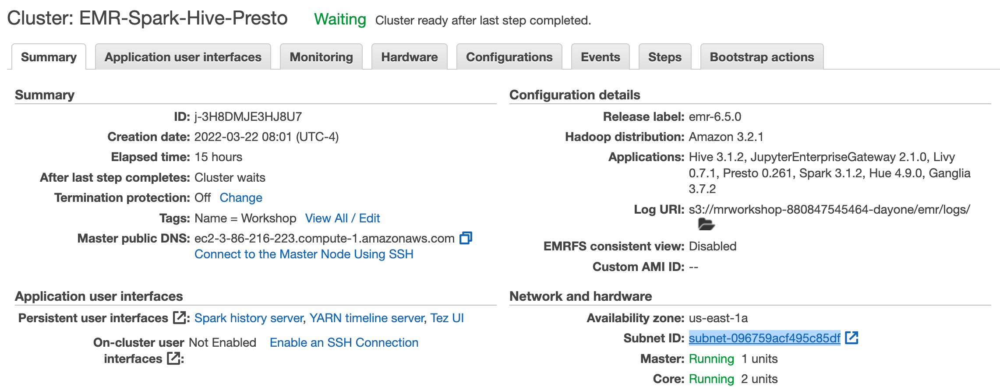
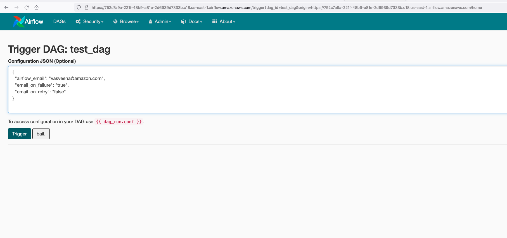
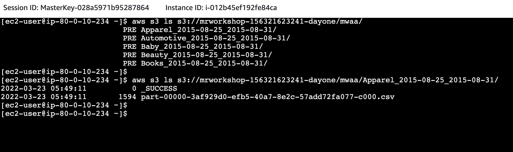

# **Orchestrating Notebook Pipelines using Amazon EMR Studio and Amazon MWAA**

In the previous [Amazon EMR Studio](/day1/studio/exercise/#parameterized-notebooks) exercise, you ran a parameterized notebook programmatically using start-notebook-execution API. In this exercise, we are going to orchestrate a pipeline with the same parameterized notebook [find_best_sellers.ipynb](https://github.com/vasveena/amazon-emr-ttt-workshop/blob/main/files/notebook/find_best_sellers.ipynb) using Amazon Managed Workflows for Apache Airflow

Go to your EMR Studio Workspace and make sure that you have "find_best_sellers.ipynb" under workspace-repo/files/notebook. If you uploaded the file manually, go to the path where you uploaded the file and make sure that the first cell in that notebook is tagged as parameters (View -> Show Right Bar -> Advanced Tools).

If this cell is not tagged as "parameters", re-do the [parameterized notebooks](/day1/studio/exercise/#parameterized-notebooks) section of Day 1 Exercises.


Once you have confirmed that, login to the EMR leader node of the cluster "EMR-Spark-Hive-Presto" or EC2 JumpHost Session Manager session. Go to [EC2 Web Console](https://us-east-1.console.aws.amazon.com/ec2/v2/home?region=us-east-1#Instances:v=3;search=:jumphost) (Right click -> Open Link in New Tab) -> Click on JumpHost -> Connect -> Session Manager -> Connect. Run the following commands.

```
sudo su ec2-user
cd ~

curl -o test_dag.py https://raw.githubusercontent.com/vasveena/amazon-emr-ttt-workshop/main/files/dags/test_dag.py

instanceProfileRole=$(aws iam list-instance-profiles-for-role --role-name emrEc2InstanceProfileRole | jq .'InstanceProfiles[].InstanceProfileName' | sed "s|\"||g")

sed -i "s|emrEc2InstanceProfileRole|$instanceProfileRole|g" test_dag.py

accountID=$(aws sts get-caller-identity --query "Account" --output text)

aws s3 cp test_dag.py s3://airflow-$accountID-dayone/dags/

```

Go to the Managed [Apache Airflow Web Console](https://us-east-1.console.aws.amazon.com/mwaa/home?region=us-east-1#environments/mwaa) (Right click -> Open Link in New Tab).


You will be able to see an Managed Airflow environment named "mwaa".


Click on "Open Airflow UI". You will be taken to the Managed Airflow UI.


Ignore the DAG Import Errors for now.

Create a file called "variables.json" like below using a notepad or a vi editor.

```

{
    "REGION": "us-east-1",
    "SUBNET_ID": "subnet-id",
    "EMR_LOG_URI": "s3://mrworkshop-youraccountID-dayone/",
    "NOTEBOOK_ID": "e-XXXXXXXXXXXXXXXXXXX",
    "NOTEBOOK_FILE_NAME": "workshop-repo/files/notebook/find_best_sellers.ipynb",
    "CATEGORIES_CSV": "Apparel,Automotive,Baby,Beauty,Books",
    "FROM_DATE": "2015-08-25",
    "TO_DATE": "2015-08-31",
    "OUTPUT_LOCATION": "s3://mrworkshop-youraccountID-dayone/mwaa/"
}

```

Replace youraccountID with your AWS Event Engine account ID. For the subnet ID, choose the subnet of the cluster "EMR-Spark-Hive-Presto" ([EMR Web Console](https://us-east-1.console.aws.amazon.com/elasticmapreduce/home?region=us-east-1#) (Right click -> Open Link in New Tab) -> EMR-Spark-Hive-Presto -> Summary tab -> Network and hardware section).



For the values of NOTEBOOK_ID and NOTEBOOK_FILE_NAME, use the same values you used in the Parameterized Notebooks exercise. i.e., take these values from your workspace URL (or from the API command you ran if you have saved it somewhere).

For example: https://e-4ac2fwhw1liin22ezilly60j8.emrnotebooks-prod.us-east-1.amazonaws.com/e-4AC2FWHW1LIIN22EZILLY60J8/lab/tree/workshop-repo/files/notebook/find_best_sellers.ipynb

**Alternate option:** Instead of manually replacing all the values in the API, run the following commands in EC2 JumpHost Session Manager session.

```
sudo su ec2-user
cd ~

cluster_id=$(aws emr list-clusters --region us-east-1 --query 'Clusters[?Name==`EMR-Spark-Hive-Presto` && Status.State!=`TERMINATED`]'.{Clusters:Id} --output text)
leader_dns=$(aws emr describe-cluster --region us-east-1 --cluster-id $cluster_id --query 'Cluster.MasterPublicDnsName' --output text)
subnet_id=$(aws ec2 describe-instances --region us-east-1 --filters "Name=dns-name,Values=$leader_dns" --query 'Reservations[*].Instances[*].SubnetId' --output text)
studio_id=$(/home/ec2-user/.local/bin/aws emr --region us-east-1 list-studios --region us-east-1 --query Studios[*].{Studios:StudioId} --output text)
studio_s3_location=$(/home/ec2-user/.local/bin/aws emr --region us-east-1 describe-studio --studio-id $studio_id --query 'Studio.DefaultS3Location' --output text)
studio_notebook_id=$(aws s3 ls $studio_s3_location/e- | sed 's|.*PRE ||g' | sed  's|/||g' | sed  's| ||g')
accountID=$(aws sts get-caller-identity --query "Account" --output text)

sudo tee ./variables.json >/dev/null <<EOF
{
    "REGION": "us-east-1",
    "SUBNET_ID": "$subnet_id",
    "EMR_LOG_URI": "s3://mrworkshop-$accountID-dayone/",
    "NOTEBOOK_ID": "$studio_notebook_id",
    "NOTEBOOK_FILE_NAME": "workshop-repo/files/notebook/find_best_sellers.ipynb",
    "CATEGORIES_CSV": "Apparel,Automotive,Baby,Beauty,Books",
    "FROM_DATE": "2015-08-25",
    "TO_DATE": "2015-08-31",
    "OUTPUT_LOCATION": "s3://mrworkshop-$accountID-dayone/mwaa/"
}
EOF

cat ./variables.json

```

You will get a JSON output with all values entered. Copy this JSON and create a file called "variables.json" in your local desktop. Paste the contents you copied. An example variables.json file with values entered:

```
{
    "REGION": "us-east-1",
    "SUBNET_ID": "subnet-096759acf495c85df",
    "EMR_LOG_URI": "s3://mrworkshop-880847545464-dayone/",
    "NOTEBOOK_ID": "e-4AC2FWHW1LIIN22EZILLY60J8",
    "NOTEBOOK_FILE_NAME": "workshop-repo/files/notebook/find_best_sellers.ipynb",
    "CATEGORIES_CSV": "Apparel,Automotive,Baby,Beauty,Books",
    "FROM_DATE": "2015-08-25",
    "TO_DATE": "2015-08-31",
    "OUTPUT_LOCATION": "s3://mrworkshop-880847545464-dayone/mwaa/"
}

```

Now let's upload this file into the Airflow UI. Go to Airflow UI -> Admin -> Variables. Click on "Choose File". Choose the variables.json you created from your local desktop and click on "Import Variables" to import the file.


Now go to the DAGs on the top left corner and you should be able to see your DAG "test_dag".


Turn on the DAG by using the Toggle switch.


This DAG will execute once at the start of each hour (based on cron schedule: 0 * * * *). For now, let us execute the DAG manually. Click on "Trigger DAG".


Trigger the DAG.



Your DAG will start to execute. Click on the DAG runs -> DAG ID -> test_dag. You will see the graph view of this execution. Analyze the steps in this DAG.


Also, analyze the DAG code by clicking on "Code".


Now, if you go to the [EMR Web Console](https://us-east-1.console.aws.amazon.com/elasticmapreduce/home?region=us-east-1#) (Right click -> Open Link in New Tab), you can see a new cluster called "Test-Cluster" being launched.


The DAG steps will create a new cluster, submit the notebook API as pipeline and terminate the cluster once the job is finished. From start to finish, this DAG will take about 15-20 mins to complete. Please note that it is not necessary to have your EMR Studio Workspace attached to an EMR cluster to be able to run this notebook pipeline since your notebooks will be persisted in the S3 location of your EMR Studio.

After 15 mins, check the DAG execution status.


Now, let's check the S3 location you provided as parameter "OUTPUT_LOCATION" in your variables.json. This is where your job output is going to be stored. Run the below command on EC2 JumpHost Session Manager session.

```
accountID=$(aws sts get-caller-identity --query "Account" --output text)
aws s3 ls s3://mrworkshop-$accountID-dayone/mwaa/

```

Alternatively, you can go to the [S3 Web Console](https://s3.console.aws.amazon.com/s3/home?region=us-east-1) (Right click -> Open Link in New Tab) and check this location from the console as well.


You should be able to see the output files for the 5 categories we passed as parameter in variables.json: "Apparel,Automotive,Baby,Beauty,Books"



After the job is finished, the cluster "Test-cluster" will be automatically terminated.


This DAG will be executed once every hour automatically. You can play around by changing the notebook parameters or pipeline schedule.

Once you are done experimenting, you can stop the DAG by using the toggle switch to turn it OFF.


