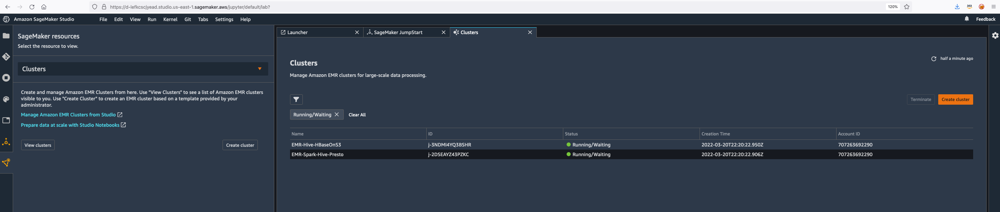

# ** Exercise 4 - Sagemaker Studio Integration with Amazon EMR **

### Create a new Sagemaker Studio

Go to the Amazon Sagemaker Web Console. Click on the  icon and choose Clusters from the Sagemaker resources drop down. You will be able to see the EMR clusters.



You can filter the EMR clusters and also create a new one with a cluster template created from AWS Service Catalog. For this time, we will use an existing cluster.

Go to File -> New -> Terminal and run the following command.

```

```
