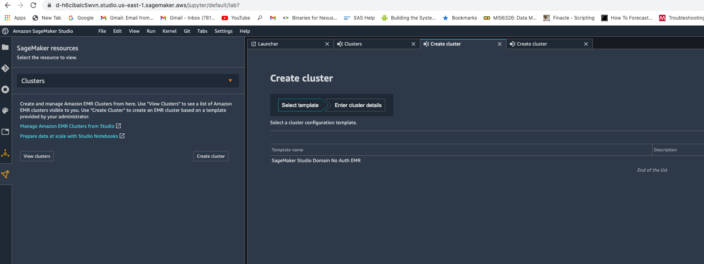

# ** Exercise 4 - Sagemaker Studio Integration with Amazon EMR **

### Create a new Sagemaker Studio

Go to the Amazon Sagemaker Web Console -> Get started -> Sagemaker Studio

Under User profile, leave Name defaulted. For Default execution role, choose "Create New Role". Choose "Any S3 Bucket". Create role.

Submit. You will now be prompted to select a VPC. Choose the "MMVPC" from the options. For subnet, choose "MMPublicSubnetOne". Save and continue.

Wait for the Sagemaker domain is ready (it will take about 3-4 mins). Once the Sagemaker domain is ready, launch the Sagemaker Studio from Launch app -> Studio.

It will take about 2 minutes to initialize after which you will be taken to the Sagemaker Studio interface.

Once you are in, carry on with rest of the steps.

### Explore EMR clusters in Sagemaker Studio

Click on the  icon and choose Clusters from the Sagemaker resources drop down. You will be able to see the EMR clusters.

You can filter the EMR clusters and also create a new one with a cluster template created from AWS Service Catalog. For this time, we will use an existing cluster.

### Connect to EMR cluster from Sagemaker Studio and run data processing jobs

Go to Git repository section and click on Clone the repository.

Specify the repository to clone: https://github.com/vasveena/amazon-emr-ttt-workshop.git

Make sure that the repository is cloned.

Go to Files section (folder icon on the left hand side pane).

Go to the directory files -> notebook -> smstudio-pyspark-hive-sentiment-analysis.ipynb. Choose the SparkMagic Kernel when prompted and click "Select".

It will take a minute or so for the kernel to initialize. Now, you can run the code blocks of the notebook. In the ln[2], uncomment the code block and replace j-xxxxxxxxxxxx with the cluster ID of "EMR-Spark-Hive-Presto" EMR cluster (obtained from EMR Web Console -> EMR-Spark-Hive-Presto -> Summary tab).
