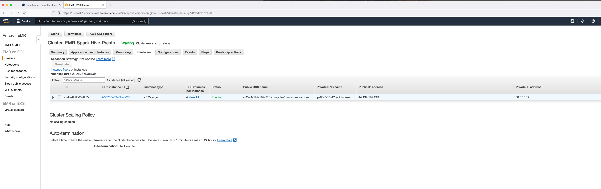
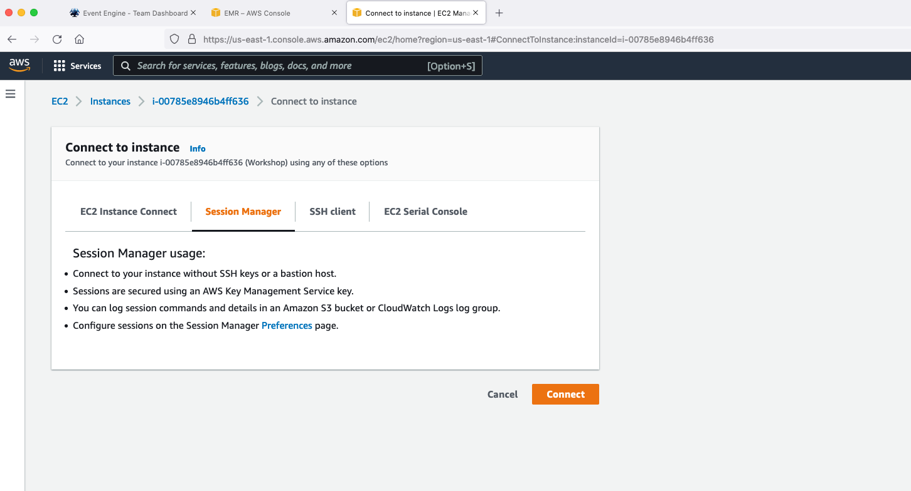
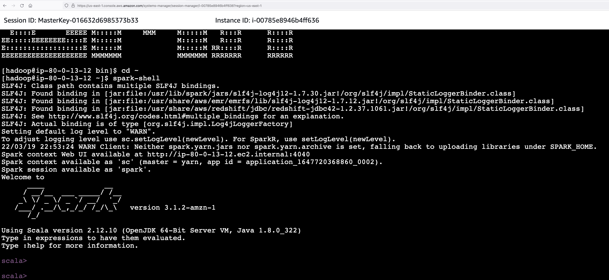
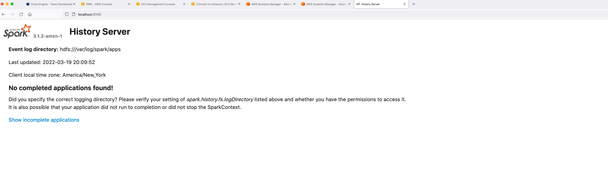
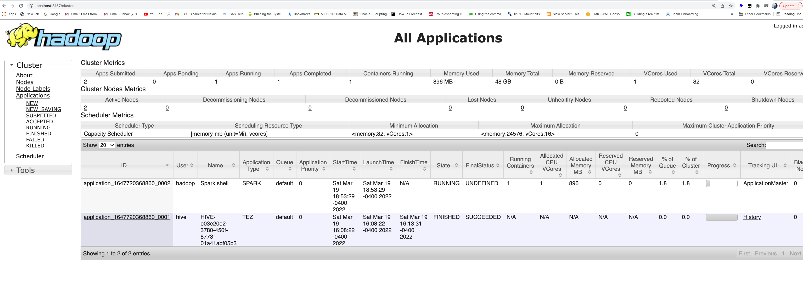
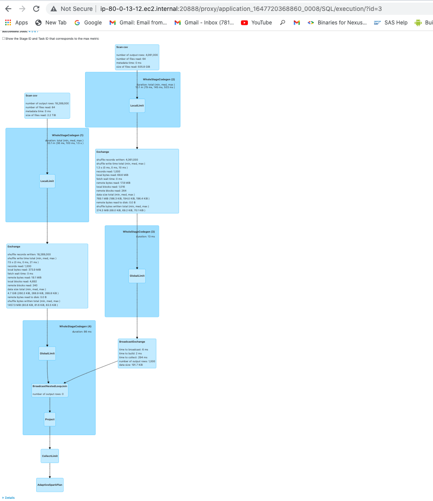
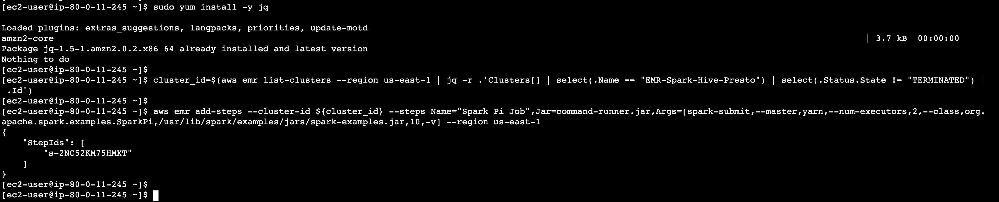
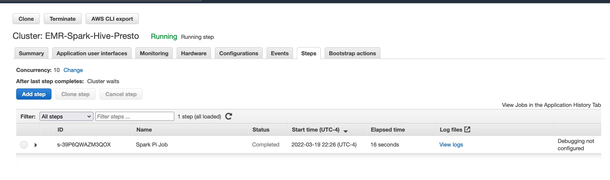

# **Apache Spark on Amazon EMR**

### Initial Setup

SSH to the leader node of the EMR cluster "EMR-Spark-Hive-Presto". The key pair you downloaded in the Setup can be used to SSH via terminal or using an SSH client like Putty. To make it easy, ssm-agent has been installed on all EMR nodes via a bootstrap action so that you can use AWS Systems Manager to login to your client EC2 instance and EMR leader node.

Go to AWS Management Console on your browser -> Amazon EMR Console -> Hardware Tab. You will see MASTER and CORE fleets. Click on the MASTER instance fleet id (looks like if-XXXXXXXXXX).


Click on the EC2 instance ID (looks like i-xxxxxxxxxxx). It should take you to the EC2 management console.



You will be navigated to the EC2 management console.


Click on “Connect” and go to the tab “Session Manager”. Click on Connect.



You will be navigated to the AWS Session Manager session. In the session, type the following commands to log in as hadoop user (default OS user for EMR).

```
sudo su hadoop
cd ~
```


You will use the same login method to log in to other EC2 instances in this workshop as well.

### Using spark-submit and spark-shell

Once you are logged into the EMR cluster using SSH or SSM agent, type “spark-shell” on your EMR Leader Node.



Once spark-shell opens and the Spark session object is created, run the commands below -  

```
import org.apache.spark.sql.types.{IntegerType,StringType,StructType,StructField,DoubleType}

val schema = StructType(Array(StructField("s_suppkey",IntegerType,true), StructField("s_name",StringType,true), StructField("s_address",StringType,true), StructField("s_nationkey", StringType, true), StructField("s_phone", StringType, true), StructField("s_acctbal", DoubleType, true), StructField("s_comment",StringType, true)))

val df = spark.read.option("delimiter", "|").schema(schema).csv("s3://redshift-downloads/TPC-H/3TB/supplier/")

df.show(5)

val df2 = df.filter($"s_acctbal" > lit(0.0)).withColumn("randdom",lit("insert random column"))

df2.show(5)

```

You will see the results in the spark-shell session.


#### Investigate Spark UI

While the Spark session is still active, you can check the Spark UI. You will need to install [AWS CLI](https://docs.aws.amazon.com/cli/latest/userguide/getting-started-install.html) and [Session Manager plugin](https://docs.aws.amazon.com/systems-manager/latest/userguide/session-manager-working-with-install-plugin.html) on your local desktop to do this.

You will also need to update your PATH variable if it is not done automatically following [this](https://docs.aws.amazon.com/systems-manager/latest/userguide/session-manager-troubleshooting.html#windows-plugin-env-var-not-set) document. Otherwise you may get the error "SessionManagerPlugin is not found". Replace --target with your leader node instance ID in the following command. Replace the environmental variables with the values from the Team Dashboard. For Windows, you will need to use "set"  instead of "export".

```

export AWS_DEFAULT_REGION=us-east-1
export AWS_ACCESS_KEY_ID=<redacted>
export AWS_SECRET_ACCESS_KEY=<redacted>
export AWS_SESSION_TOKEN=<redacted>

```

Run the below command. Replace target with your leader node instance ID

```

aws ssm start-session --target i-00785e8946b4ff636 --document-name AWS-StartPortForwardingSession --parameters '{"portNumber":["18080"], "localPortNumber":["8158"]}' --region us-east-1

```
Following image shows the commands run in macOS terminal. *18080* is the Spark History Server Port and *8157* is the local port.


Now open http://localhost:8158 in your browser.  



Click on "Show incomplete applications" -> App ID (for eg: application_1647720368860_0002). Check out all the tabs especially the SQL tab.


Click on "show" (Spark action) in the SQL tab to see the query plan.


#### Alternative approach - Local SSH tunneling

Please note that with this approach, you cannot access YARN Resource Manager UI. You can access it via [local port forwarding](https://docs.aws.amazon.com/emr/latest/ManagementGuide/emr-ssh-tunnel-local.html) by running the following command in your local desktop's terminal or using Putty for Windows. Replace leaderNodePublicDNS with your leader node public DNS (obtained from EMR Web Console -> EMR-Spark-Hive-Presto -> Summary tab -> Master public DNS).

```

ssh -i ~/ee-default-keypair.pem -N -L 8157:leaderNodePublicDNS:8088 hadoop@leaderNodePublicDNS

```

Now enter http://localhost:8157 on your browser to see the Resource Manager UI. You can use this method as well to access Spark UI (replace port 8088 in the above command with port 18080).



#### Optimization exercise (Optional)

**Converting inefficient join types**

Run the below code block in spark-shell. Set driver memory to 4G while starting the shell.

spark-shell --driver-memory=4G

```
import org.apache.spark.sql.types._

val liSchema = StructType(Array(
  StructField("l_orderkey", StringType, true),
  StructField("l_partkey", IntegerType, true),
  StructField("l_suppkey", IntegerType, true),
  StructField("l_linenumber", IntegerType, true),
  StructField("l_quantity", IntegerType, true),
  StructField("l_extendedprice", IntegerType, true),
  StructField("l_discount", DoubleType, true),
  StructField("l_tax", DoubleType, true),
  StructField("l_returnflag", StringType, true),
  StructField("l_linestatus", StringType, true),
  StructField("l_shipdate", StringType, true),
  StructField("l_commitdate", StringType, true),
  StructField("l_receiptdate", StringType, true),
  StructField("l_shipinstruct", StringType, true),
  StructField("l_shipmode", StringType, true),
  StructField("l_comment", StringType, true)
  )
)

val orSchema = StructType(Array(
  StructField("o_orderkey", StringType, true),
  StructField("o_custkey", IntegerType, true),
  StructField("o_orderstatus", StringType, true),
  StructField("o_totalprice", DoubleType, true),
  StructField("o_orderdate", StringType, true),
  StructField("o_orderpriority", StringType, true),
  StructField("o_clerk", StringType, true),
  StructField("o_shippriority", IntegerType, true),
  StructField("o_comment", StringType, true)
  )
)

val df1 = spark.read.schema(liSchema).option("delimiter","|").csv("s3://redshift-downloads/TPC-H/2.18/3TB/lineitem/")
val df2 = spark.read.schema(orSchema).option("delimiter","|").csv("s3://redshift-downloads/TPC-H/2.18/3TB/orders/")
val lineitem = df1.limit(1000)
val orders = df2.limit(1000)

val nestedLoopDF = lineitem.join(orders, lineitem("l_orderkey") === orders("o_orderkey") || lineitem("l_receiptdate") === orders("o_orderdate"))
nestedLoopDF.show(5,truncate=false)

```

Check the Spark UI -> SQL tab -> show (Spark action). You will be able to see that the above code uses BroadcastNestedLoopJoin as the join type.



BroadcastNestedLoopJoin is an inefficient join that results from bad coding practice. Convert it into SortMergeJoin or BroadcastJoin by changing the code.

```
val result1 = lineitem.join(orders, lineitem("l_orderkey") === orders("o_orderkey"))
val result2 = lineitem.join(orders, lineitem("l_receiptdate") === orders("o_orderdate"))
val broadcastDF = result1.union(result2)
broadcastDF.show(5,truncate=false)
```

Check the Spark UI now. You will be able to see that BroadcastHashJoin is being used instead which is the best join type if at least one of the two tables you are going to join is relatively small (<50MB). Default *spark.sql.autoBroadcastJoinThreshold* is 10 MB.


### Submit Spark Work to EMR using AddSteps API

Let us submit Spark work to the cluster using EMR’s [AddSteps](https://docs.aws.amazon.com/cli/latest/reference/emr/add-steps.html) API.

Copy the EMR Cluster ID in the Summary Tab of your EMR cluster "EMR-Spark-Hive-Presto" from EMR Web Console. It looks like ‘j-XXXXXXXXXX’.


You can submit steps to your EMR from your local desktop after exporting the AWS credentials in your Team Dashboard page.

For windows, use set instead of export.

```

export AWS_DEFAULT_REGION=us-east-1
export AWS_ACCESS_KEY_ID=<redacted>
export AWS_SECRET_ACCESS_KEY=<redacted>
export AWS_SESSION_TOKEN=<redacted>

```

Run the below command. Replace cluster-id value with your cluster ID.

```

aws emr add-steps --cluster-id j-XXXXXXXXXX --steps Name="Spark Pi Job",Jar=command-runner.jar,Args=[spark-submit,--master,yarn,--num-executors,2,--class,org.apache.spark.examples.SparkPi,/usr/lib/spark/examples/jars/spark-examples.jar,10,-v] --region us-east-1

```

If you cannot use AWS CLI for some reason, you will find an EC2 instance called "JumpHost" in the EC2 Web Console. In real life scenario, you can run this command from any machine as long as your IAM user or role has IAM access to invoke EMR AddSteps API.


You can connect to that instance using Session Manager and submit step to EMR cluster from that session. Once connected, enter following commands to login as ec2-user (default OS user for EC2 instances).

```
sudo su ec2-user
cd ~

```

Now, run the AddSteps CLI command below. Replace cluster-id value with your cluster ID. You do not need to export any credentials since the IAM role attached to this JumpHost has all accesses required.

```
aws emr add-steps --cluster-id j-142PVKGDZTTXS --steps Name="Spark Pi Job",Jar=command-runner.jar,Args=[spark-submit,--master,yarn,--num-executors,2,--class,org.apache.spark.examples.SparkPi,/usr/lib/spark/examples/jars/spark-examples.jar,10,-v] --region us-east-1
```



Now, check the EMR step that was submitted to the cluster.



You can look into the stdout logs to see the output.


