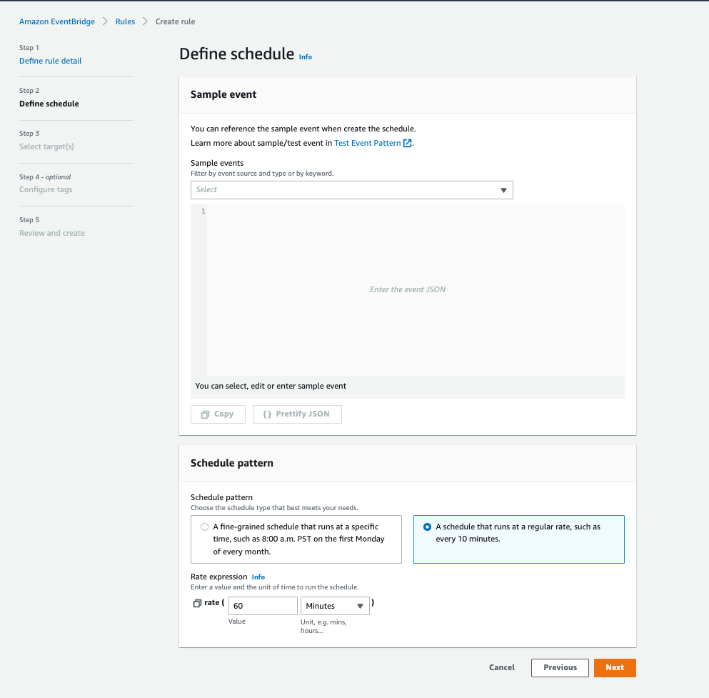

# **Orchestrating EMR Steps using AWS Step Functions**

In the previous section, we saw how you can leverage EMR AddSteps API to submit a Spark work to the cluster. You can submit any type of work to the EMR cluster (Hive, Presto, Bash etc.).

In this section, we will see how you can orchestrate EMR jobs using EMR Step API and AWS Steps Functions. For a variation, let's orchestrate Hive EMR Steps. But you can choose any EMR step of your choice.

### Create State Machine

Go to [IAM Web Console](https://us-east-1.console.aws.amazon.com/iamv2/home?region=us-east-1#/roles/create?commonUseCase=EC2&step=addPermission&trustedEntityType=AWS_SERVICE) to create a role for executing AWS Step Functions.

Under "Use cases for other AWS services", type and select "Step Functions". Click on the Step Functions and click Next.


In the next page "Add permissions", under the "Set permissions boundary - optional" -> Use a permissions boundary to control the maximum role permissions -> Permission policies -> search and choose "AdministratorAccess". Please note we are doing this only for convenience. In production scenario, you should only allow necessary and restrictive permissions to this IAM role.


Click on Next.

For role name, type "emr-stepfunc-role".


Create the IAM Role.

Go to [AWS Step Functions console](https://us-east-1.console.aws.amazon.com/states/home?region=us-east-1#/statemachines?helloWorld) (Right click -> Open Link in New Tab).


Click on "Create State Machine". In Step 1 (Define state machine), choose "Write your workflow in code". Let Type be "Standard".


Copy the entire blurb below and paste into a notepad or any text editor in your local desktop.

```
{
  "StartAt": "Should_Create_Cluster",
  "States": {
    "Should_Create_Cluster": {
      "Type": "Choice",
      "Choices": [
        {
          "Variable": "$.CreateCluster",
          "BooleanEquals": true,
          "Next": "Create_A_Cluster"
        },
        {
          "Variable": "$.CreateCluster",
          "BooleanEquals": false,
          "Next": "Enable_Termination_Protection"
        }
      ],
      "Default": "Create_A_Cluster"
    },
    "Create_A_Cluster": {
      "Type": "Task",
      "Resource": "arn:aws:states:::elasticmapreduce:createCluster.sync",
      "Parameters": {
        "Name": "WorkflowCluster",
        "VisibleToAllUsers": true,
        "ReleaseLabel": "emr-5.28.0",
        "Applications": [{ "Name": "Hive" }],
        "ServiceRole": "emrServiceRole",
        "JobFlowRole": "emrEc2InstanceProfile",
        "Instances": {
          "KeepJobFlowAliveWhenNoSteps": true,
          "InstanceFleets": [
            {
              "InstanceFleetType": "MASTER",
              "TargetOnDemandCapacity": 1,
              "InstanceTypeConfigs": [
                {
                  "InstanceType": "m4.xlarge"
                }
              ]
            },
            {
              "InstanceFleetType": "CORE",
              "TargetOnDemandCapacity": 1,
              "InstanceTypeConfigs": [
                {
                  "InstanceType": "m4.xlarge"
                }
              ]
            }
          ]
        }
      },
      "ResultPath": "$.CreateClusterResult",
      "Next": "Merge_Results"
    },
    "Merge_Results": {
      "Type": "Pass",
      "Parameters": {
        "CreateCluster.$": "$.CreateCluster",
        "TerminateCluster.$": "$.TerminateCluster",
        "ClusterId.$": "$.CreateClusterResult.ClusterId"
      },
      "Next": "Enable_Termination_Protection"
    },
    "Enable_Termination_Protection": {
      "Type": "Task",
      "Resource": "arn:aws:states:::elasticmapreduce:setClusterTerminationProtection",
      "Parameters": {
        "ClusterId.$": "$.ClusterId",
        "TerminationProtected": true
      },
      "ResultPath": null,
      "Next": "Add_Steps_Parallel"
    },
    "Add_Steps_Parallel": {
      "Type": "Parallel",
      "Branches": [
        {
          "StartAt": "Step_One",
          "States": {
            "Step_One": {
              "Type": "Task",
              "Resource": "arn:aws:states:::elasticmapreduce:addStep.sync",
              "Parameters": {
                "ClusterId.$": "$.ClusterId",
                "Step": {
                  "Name": "The first step",
                  "ActionOnFailure": "CONTINUE",
                  "HadoopJarStep": {
                    "Jar": "command-runner.jar",
                    "Args": [
                      "hive-script",
                      "--run-hive-script",
                      "--args",
                      "-f",
                      "s3://eu-west-1.elasticmapreduce.samples/cloudfront/code/Hive_CloudFront.q",
                      "-d",
                      "INPUT=s3://eu-west-1.elasticmapreduce.samples",
                      "-d",
                      "OUTPUT=s3://mrworkshop-youraccountID-dayone/StepFunc/MyHiveQueryResults/"
                    ]
                  }
                }
              },
              "End": true
            }
          }
        },
        {
          "StartAt": "Wait_10_Seconds",
          "States": {
            "Wait_10_Seconds": {
              "Type": "Wait",
              "Seconds": 10,
              "Next": "Step_Two (async)"
            },
            "Step_Two (async)": {
              "Type": "Task",
              "Resource": "arn:aws:states:::elasticmapreduce:addStep",
              "Parameters": {
                "ClusterId.$": "$.ClusterId",
                "Step": {
                  "Name": "The second step",
                  "ActionOnFailure": "CONTINUE",
                  "HadoopJarStep": {
                    "Jar": "command-runner.jar",
                    "Args": [
                      "hive-script",
                      "--run-hive-script",
                      "--args",
                      "-f",
                      "s3://eu-west-1.elasticmapreduce.samples/cloudfront/code/Hive_CloudFront.q",
                      "-d",
                      "INPUT=s3://eu-west-1.elasticmapreduce.samples",
                      "-d",
                      "OUTPUT=s3://mrworkshop-youraccountID-dayone/StepFunc/MyHiveQueryResults/"
                    ]                  
                  }
                }
              },
              "ResultPath": "$.AddStepsResult",
              "Next": "Wait_Another_10_Seconds"
            },
            "Wait_Another_10_Seconds": {
              "Type": "Wait",
              "Seconds": 10,
              "Next": "Cancel_Step_Two"
            },
            "Cancel_Step_Two": {
              "Type": "Task",
              "Resource": "arn:aws:states:::elasticmapreduce:cancelStep",
              "Parameters": {
                "ClusterId.$": "$.ClusterId",
                "StepId.$": "$.AddStepsResult.StepId"
              },
              "End": true
            }
          }
        }
      ],
      "ResultPath": null,
      "Next": "Step_Three"
    },
    "Step_Three": {
      "Type": "Task",
      "Resource": "arn:aws:states:::elasticmapreduce:addStep.sync",
      "Parameters": {
        "ClusterId.$": "$.ClusterId",
        "Step": {
          "Name": "The third step",
          "ActionOnFailure": "CONTINUE",
          "HadoopJarStep": {
            "Jar": "command-runner.jar",
            "Args": [
                      "hive-script",
                      "--run-hive-script",
                      "--args",
                      "-f",
                      "s3://eu-west-1.elasticmapreduce.samples/cloudfront/code/Hive_CloudFront.q",
                      "-d",
                      "INPUT=s3://eu-west-1.elasticmapreduce.samples",
                      "-d",
                      "OUTPUT=s3://mrworkshop-youraccountID-dayone/StepFunc/MyHiveQueryResults/"
             ]
          }
        }
      },
      "ResultPath": null,
      "Next": "Disable_Termination_Protection"
    },
    "Disable_Termination_Protection": {
      "Type": "Task",
      "Resource": "arn:aws:states:::elasticmapreduce:setClusterTerminationProtection",
      "Parameters": {
        "ClusterId.$": "$.ClusterId",
        "TerminationProtected": false
      },
      "ResultPath": null,
      "Next": "Should_Terminate_Cluster"
    },
    "Should_Terminate_Cluster": {
      "Type": "Choice",
      "Choices": [
        {
          "Variable": "$.TerminateCluster",
          "BooleanEquals": true,
          "Next": "Terminate_Cluster"
        },
        {
          "Variable": "$.TerminateCluster",
          "BooleanEquals": false,
          "Next": "Wrapping_Up"
        }
      ],
      "Default": "Wrapping_Up"
    },
    "Terminate_Cluster": {
      "Type": "Task",
      "Resource": "arn:aws:states:::elasticmapreduce:terminateCluster.sync",
      "Parameters": {
        "ClusterId.$": "$.ClusterId"
      },
      "Next": "Wrapping_Up"
    },
    "Wrapping_Up": {
      "Type": "Pass",
      "End": true
    }
  }
}
```

You can run the below commands on EC2 Jump Host Session Manager session to get the values you have to replace.

```
sudo su ec2-user
cd ~

accountID=`aws sts get-caller-identity --query "Account" --output text`

instProfRole=`aws iam list-instance-profiles-for-role --role-name emrEc2InstanceProfileRole | jq .'InstanceProfiles[].InstanceProfileName' | sed "s|\"||g"`

printf "\n\n\n\nReplace the following values in your State Machine definition....\n\n\n\n"

```

Get the output account ID and EMR Instance Profile Role.

```
echo $accountID
echo $instProfRole

```

Replace the string "youraccountID" (in 3 places) with your AWS event engine account ID obtained from the AWS Web Console. Also, replace the EMR Instance Profile Role "emrEc2InstanceProfileRole" (in one place). Make sure there are no control characters.

Once you have updated, copy the entire content from your notepad or text editor and paste it onto the "Definition" section in the AWS Step Functions console.


You will see the state machine DAG being generated automatically.  


Click on "Next". Name your State Machine as "EMR-Steps-State-Machine". Under "Permissions", select "Choose an existing role" and from the drop down, choose the IAM role we created "emr-stepfunc-role".

Leave everything else as default. Click on "Create State Machine".


### Execute State Machine

Once the State Machine is created, click on Start Execution.


Enter the below JSON in the "Input - optional" section (replace any existing string). Click on "Start Execution".

```
{
  "CreateCluster": true,
  "TerminateCluster": true
}
```


You will see the State Machine executing. It should start creating an EMR cluster called "WorkflowCluster" if you check the [EMR Web Console](https://us-east-1.console.aws.amazon.com/elasticmapreduce/home?region=us-east-1#) (Right click -> Open Link in New Tab).


It will take about 15 minutes for the State Machine to finish executing. Once State Machine is done with the execution, it will look like below. Execution Status should be "Succeeded".


Go to the EMR cluster "WorkflowCluster" from [EMR Web Console](https://us-east-1.console.aws.amazon.com/elasticmapreduce/home?region=us-east-1#) (Right click -> Open Link in New Tab). Go to the "Steps" tab. You can see the three EMR Steps submitted and executed by the AWS Step Functions.


The EMR cluster will be automatically terminated once the State Machine completes its execution.

You can also start State Machine execution by entering the below JSON in the "Input - optional" section (replace any existing string). i.e., you can specify an existing EMR cluster ID instead of having AWS Step Functions create a new EMR cluster. You will need to replace j-XXXXXXXXXX with an existing EMR cluster ID in your AWS event engine account.

```
{
  "CreateCluster": false,
  "TerminateCluster": false,
  "ClusterId": "j-XXXXXXXXXX"
}
```

### Schedule AWS Step Functions with Amazon Event Bridge

We triggered the execution on-demand. We can also leverage Event Bridge

Go to [AWS Step Functions Console](https://us-east-1.console.aws.amazon.com/states/home?region=us-east-1#/statemachines) (Right click -> Open Link in New Tab). Click on the state machine we created "EMR-Steps-State-Machine".

On the right hand side, from Actions drop down, choose "Create Event Bridge (CloudWatch Events) rule".


It will take you to a new tab to create Amazon Event Bridge Rule.

Specify rule name "emr-stepfunc-rule". Under "Rule type", select "Schedule". Click Next.


In Step 2 (Define schedule), under "Schedule pattern", choose "A schedule that runs at a regular rate, such as every 10 minutes.". Under "Rate expression", choose 60 minutes. Click Next.



In Step 3 (Select targets), for "Target types", choose AWS service. In "Select a target", type and choose "Step Functions state machine". Under "State machine", choose the State Machine we created "EMR-Steps-State-Machine". Under "Execution role", choose "Create a new role for this specific resource".

Expand the "Additional settings" section. Under "Configure target input", choose "Constant (JSON Text)" and enter the following input JSON. Leave everything else as default.

```
{
  "CreateCluster": true,
  "TerminateCluster": true
}
```


Click Next. In Step 4 (Configure tags), just click Next.

In Step 5 (Review and Create), review the details and click on "Create rule". The Event Bridge rule will be created.


This rule will execute the AWS Step Functions every 60 mins and will take effect immediately. In your AWS Step Functions, you will see the state machine getting executed.


Once you are done experimenting, you can disable the Amazon EventBridge rule to avoid cluttering the EMR Web Console. Go to [Amazon Event Bridge Console](https://us-east-1.console.aws.amazon.com/events/home?region=us-east-1#/rules) (Right click -> Open Link in New Tab) -> click on "emr-stepfunc-rule" -> Disable.


