# **Amazon EMR Studio**

### Log in to EMR Studio

In this exercise we will run Spark workflows using EMR Studio with managed Jupyter-based notebooks. We will also cover the most standout features of Amazon EMR Studio.

Go to the EMR Web Console and navigate to "EMR Studio" on the right hand side. Click on "Get Started".

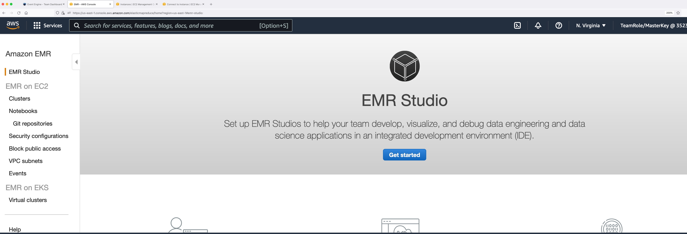

You will be able to see an EMR Studio created called "workshop-studio". Click on it and in the following page, copy the Studio URL.


Open an incognito or a private browser and paste the URL. In the AWS login page, choose "IAM User" and enter the account ID retrieved from your event engine's AWS Web console. Click on Next.


Under IAM user name, enter  "studiouser". Under password, enter Test123$. Click on Sign in.


You will be logged into the EMR Studio. Users can access this interface without requiring AWS Web Console access. EMR Studio supports both IAM and SSO auth modes.

### Check EMR clusters from EMR Studio

Check the clusters under EMR on EC2. You can filter the clusters. Click on "EMR-Spark-Hive-Presto" and go to "Launch application UI -> Spark History Server".

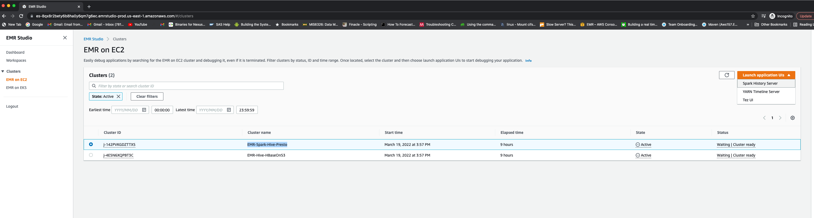

You will be taken to the EMR Persistent Spark History Server. You can also see the UIs of terminated clusters for up to 60 days after termination.


### Create a Studio Workspace

Go to Workspaces and "Create Workspace".

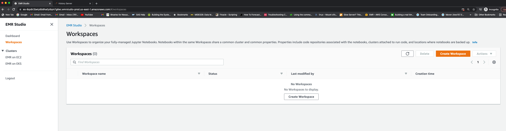

Enter a workspace name. For example: "studio-ws". Enable "Allow Workspace Collaboration". Under "Advanced Configuration", select "Attach Workspace to an EMR cluster". In the drop down, choose the EMR-Spark-Hive-Presto cluster. Click "Create Workspace".


It will take about 2 minutes for the Status to change to "Attached".  


Click on the workspace and it will open a managed JupyterLab session. You may need to allow pop-up from this address in your browser to open the JupyterLab. Once opened, you can create a Jupyter notebook with any kernel.

### Explore EMR Studio Workspace Features

#### Cluster
Under cluster tab, check the cluster attachment.

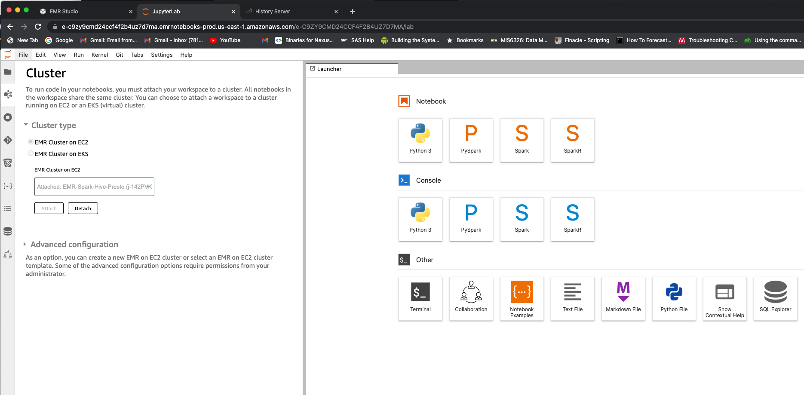

Note that you will be able to detach and attach this workspace to a different cluster. For now, you can leave it as is.

#### Git repository
Under Git tab, you can add a Git repository by entering the repository name, URL and credentials. You can access public repositories without any credentials.

Repository name: workshop-repo

Git repository URL: https://github.com/vasveena/amazon-emr-ttt-workshop

Branch: main

Git credentials: Use a public repository without credentials

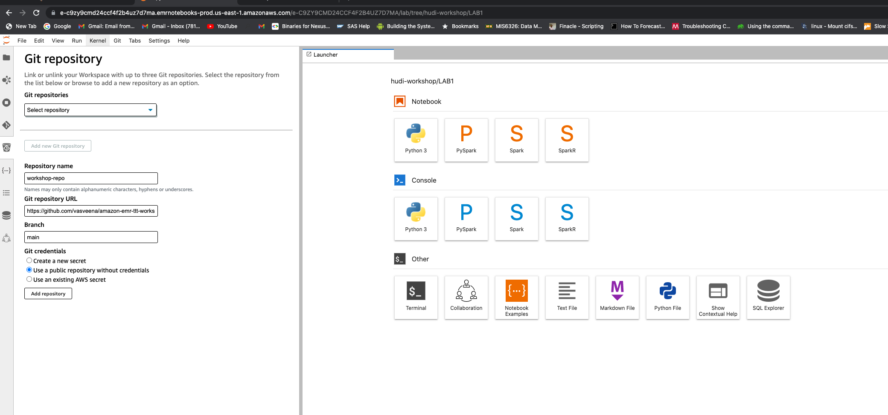

Once the repository is added, select it from the "Git repositories" drop down. You will see that the Git repository will be linked successfully.
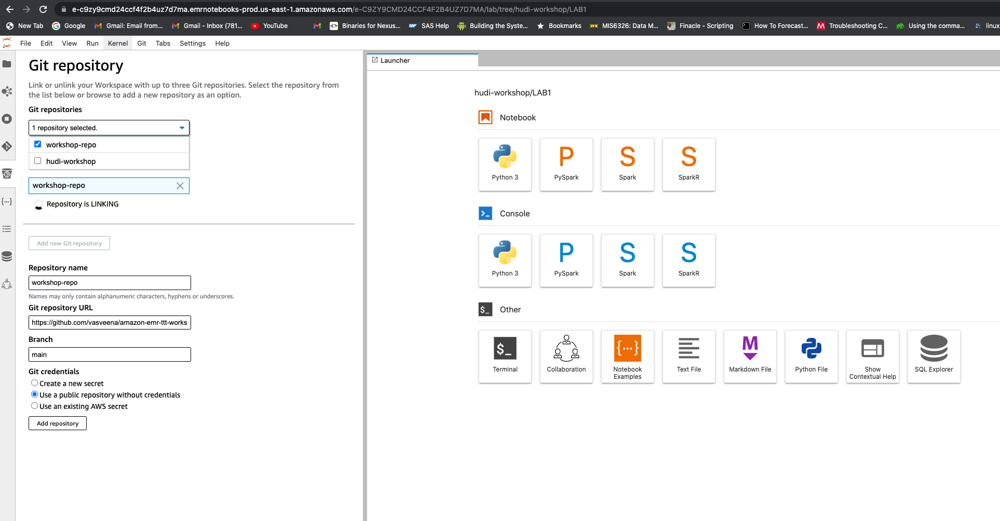

Once its linked, you can go back to the workspace folder. You will find a folder called "workshop-repo".

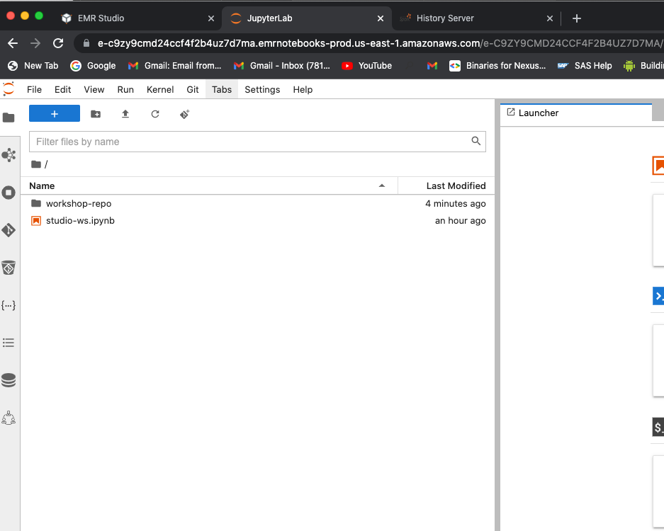

Go to workshop-repo -> files -> notebook to see the notebooks.

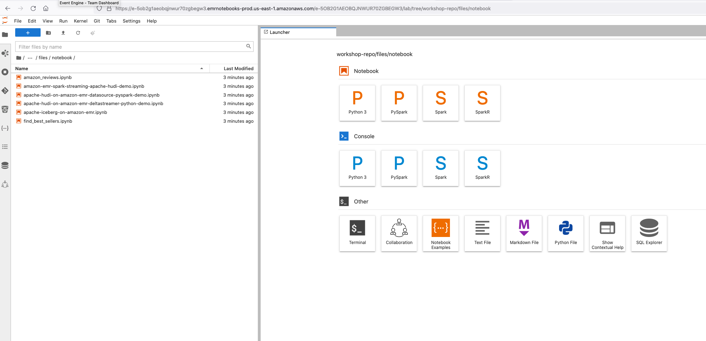

If you are not able to link repository successfully, download [amazon_reviews.ipynb](https://raw.githubusercontent.com/vasveena/amazon-emr-ttt-workshop/main/files/notebook/amazon_reviews.ipynb) and [find_best_sellers.ipynb](https://raw.githubusercontent.com/vasveena/amazon-emr-ttt-workshop/main/files/notebook/find_best_sellers.ipynb) files to your local desktop (Right click -> Save Link As). Upload these two files from your local desktop to the JupyterLab. Upload icon looks like .

#### Notebook-scoped libraries

Run all the cells in amazon-reviews.ipynb notebook. Make sure Pyspark kernel is selected.

Notice the notebook scoped libraries installed on SparkContext sc.

```
sc.list_packages()

sc.install_pypi_package("pandas==1.0.1") #Install pandas version 1.0.5
sc.install_pypi_package("numpy==1.20.2") #Intall numpy version 1.19.5
sc.install_pypi_package("matplotlib==3.2.0","https://pypi.org/simple") #Install matplotlib from given PyPI repository

sc.list_packages()
```

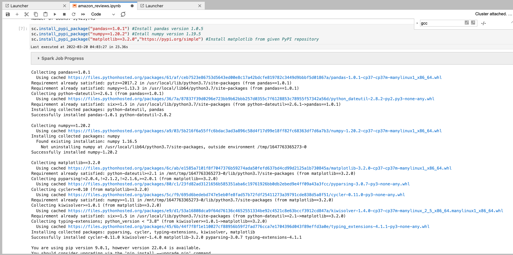

You will use these installed dependencies to plot visualizations on top of Amazon Reviews data.

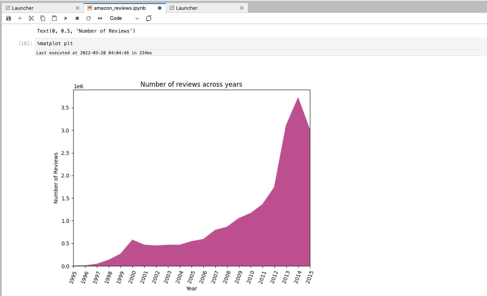

You can have two notebooks within the same workspace with different dependencies. You can even reproduce these dependencies and run the same notebook after your cluster is terminated by attaching it to a different active cluster.

When you are done, terminate the kernel by clicking on stop icon .

#### Parameterized notebooks

Open the file find_best_sellers.ipynb. Go to View -> Show Right Sidebar.

Click on the first cell with comment "Default parameters". In the Right Sidebar, click on "Add tag" and  type "parameters" and click "+". Now check the "Advanced Tools" and make sure that the parameters tag is applied to that cell.

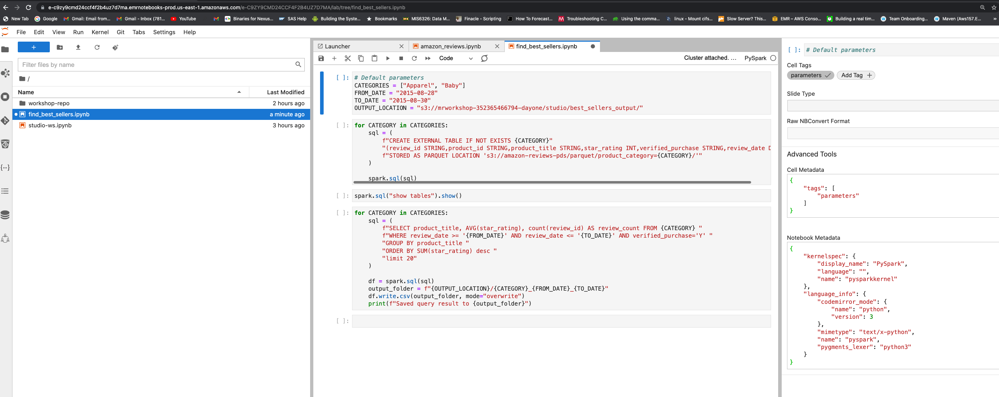

Replace OUTPUT_LOCATION "s3://mrworkshop-<accountID>-dayone/studio/best_sellers_output/" with your event engine AWS account ID. Check the S3 Web Console for the bucket name if required. Do not create the S3 prefix "studio" before running the notebook cells.

Run all the cells in the notebook and make sure the outputs for categories "Apparel" and "Baby" are created under the S3 output location using AWS CLI or S3 Web Console.

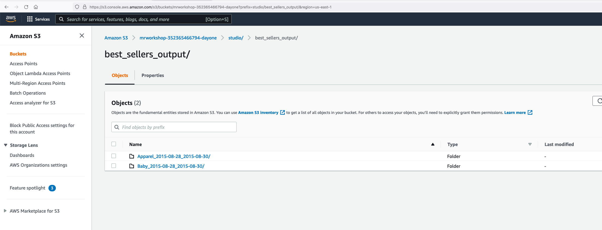

Save the notebook. When you are done, terminate the kernel by clicking on stop icon .

#### Notebooks API

Let us run the parameterized notebook "find_best_sellers.ipynb" using EMR Notebooks API.

Run the below command with your JumpHost EC2 instance (connected with Session Manager).

```
aws s3 ls s3://amazon-reviews-pds/parquet/product_category
```

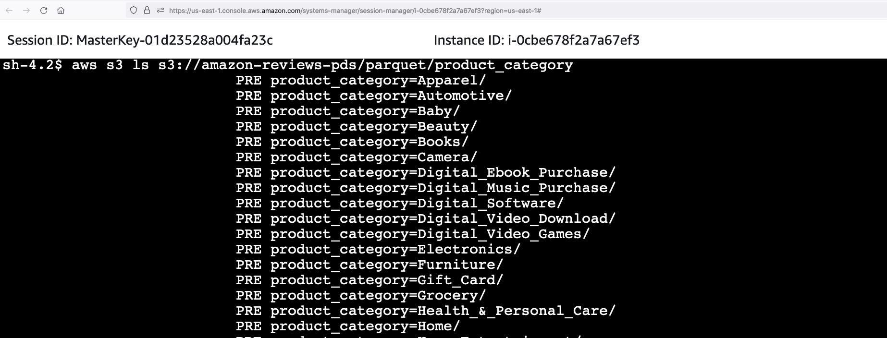

You can see the list of categories. From EMR Studio, we ran analysis for categories "Apparel" and "Baby". Now let us run this notebook from API for categories "Furniture" and "PC". You can select whichever categories you want.

Run following commands in your EC2 JumpHost to upgrade your AWS CLI.

```
sudo su ec2-user
cd ~

pip3 uninstall awscli -y
pip3 install awscli --upgrade

/home/ec2-user/.local/bin/aws --version
```

Verify that the notebooks APIs are working

```
/home/ec2-user/.local/bin/aws emr --region us-east-1 list-studios
```

Copy the editor-ID from notebook URL. For example: https://e-c9zy9cmd24ccf4f2b4uz7d7ma.emrnotebooks-prod.us-east-1.amazonaws.com/e-C9ZY9CMD24CCF4F2B4UZ7D7MA/lab/tree/workshop-repo/files/notebook/find_best_sellers.ipynb

"e-C9ZY9CMD24CCF4F2B4UZ7D7MA" is the editor ID. In the following command, replace your editor-id with this value.
Cluster ID in --execution-engine should be replaced with your EMR cluster "EMR-Spark-Hive-Presto" cluster ID (Obtained from AWS Management Console -> Amazon EMR Console -> Summary tab. Looks like j-XXXXXXXXX)
Change "youraccountID" in the OUTPUT_LOCATION parameter with your account ID.

```
/home/ec2-user/.local/bin/aws emr --region us-east-1 \
start-notebook-execution \
--editor-id e-XXXXXXXXXXXXXXXXX \
--notebook-params '{"CATEGORIES":["Furniture","PC"], "FROM_DATE":"2015-08-27", "TO_DATE":"2015-08-31", "OUTPUT_LOCATION": "s3://mrworkshop-youraccountID-dayone/studio/best_sellers_output_fromapi/"}' \
--relative-path workshop-repo/files/notebook/find_best_sellers.ipynb \
--notebook-execution-name demo-execution \
--execution-engine '{"Id" : "j-XXXXXXXXXXXXX"}' \
--service-role emrStudioRole

```

{
    "NotebookExecutionId": "ex-J02QDLG4TWXSNWLO4OGZ9NNX609MV"
}

You will get a NotebookExecutionId in return. Use this NotebookExecutionId in the following command to check for status.

```
aws emr --region us-east-1 describe-notebook-execution --notebook-execution-id ex-J02QDLG4TWXSNWLO4OGZ9NNX609MV

```

After about 2-3 minutes, the Status will be FINISHED.

```
aws emr --region us-east-1 describe-notebook-execution --notebook-execution-id ex-J02QDLG4TWXSNWLO4OGZ9NNX609MV
{
   "NotebookExecution": {
       "Status": "FINISHED",
       "ExecutionEngine": {
           "MasterInstanceSecurityGroupId": "sg-066e6805267d1d69c",
           "Type": "EMR",
           "Id": "j-142PVKGDZTTXS"
       },
       "NotebookParams": "{\"CATEGORIES\":[\"Furniture\",\"PC\"], \"FROM_DATE\":\"2015-08-27\", \"TO_DATE\":\"2015-08-31\", \"OUTPUT_LOCATION\": \"s3://mrworkshop-352365466794-dayone/studio/best_sellers_output_fromapi/\"}",
       "Tags": [],
       "OutputNotebookURI": "s3://studio-352365466794-dayone/notebook/e-C9ZY9CMD24CCF4F2B4UZ7D7MA/executions/ex-J02QDLG4TWXSNWLO4OGZ9NNX609MV/find_best_sellers.ipynb",
       "NotebookExecutionName": "demo-execution",
       "LastStateChangeReason": "Execution is finished for cluster j-142PVKGDZTTXS.",
       "StartTime": 1647768150.761,
       "NotebookExecutionId": "ex-J02QDLG4TWXSNWLO4OGZ9NNX609MV",
       "EndTime": 1647768220.416,
       "EditorId": "e-C9ZY9CMD24CCF4F2B4UZ7D7MA",
       "Arn": "arn:aws:elasticmapreduce:us-east-1:352365466794:notebook-execution/ex-J02QDLG4TWXSNWLO4OGZ9NNX609MV",
       "NotebookInstanceSecurityGroupId": "sg-05e5e70bcaa4a624f"
   }
}

```

Now let us check the S3 output path. You will now see a new prefix called "best_sellers_output_fromapi" with files generated under categories "Furniture" and "PC".

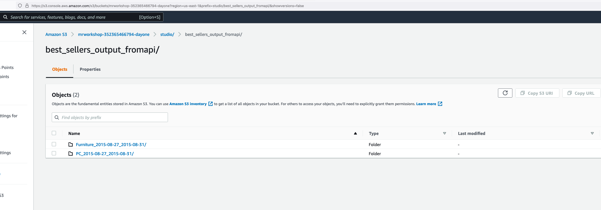

We will see in tomorrow's exercise how to orchestrate a pipeline with this parameterized notebook using Amazon Managed Workflows for Apache Airflow.

#### SQL Explorer

Lets check the new SQL explorer feature which helps you run ad-hoc and interactive queries against your tables.

Go to the SQL explorer and select "default" database. You will be able to see the four tables created in Glue catalog for the 4 categories apparel, baby, furniture and PC from our previous job runs.

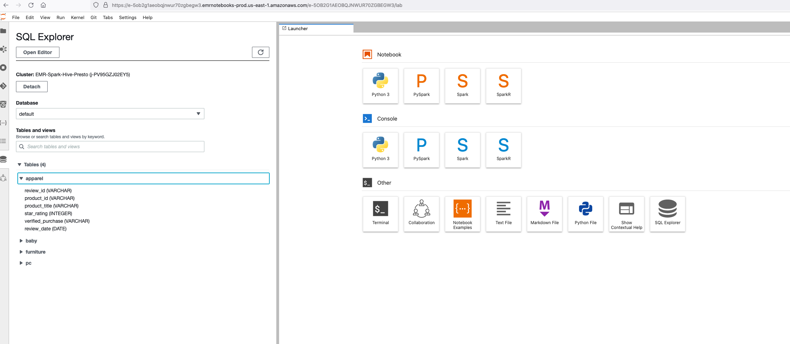

Click on "Open Editor" and query the tables.

```
select * from default.baby limit 10;

```

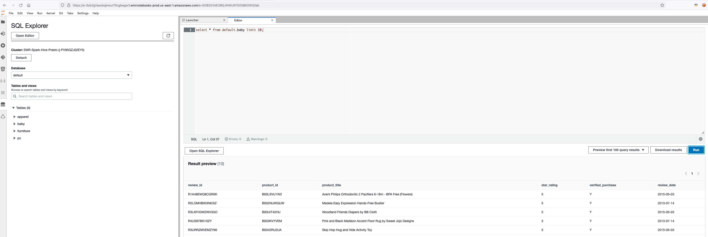

#### Collaborators

Workspace collaboration is a new feature introduced in EMR Studio. Currently, we are logged in as studiouser.

Go to the root folder and choose studio-ws.ipynb which is the default notebook created for this workspace. You can choose any kernel. Let us choose Python3 kernel for this time. Type the following command on the cell.

```
print("hello world")

```

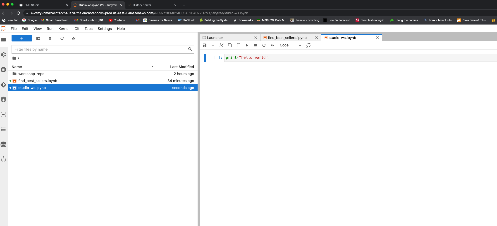

Now go to the Collaborators section and add the IAM user "collabuser".

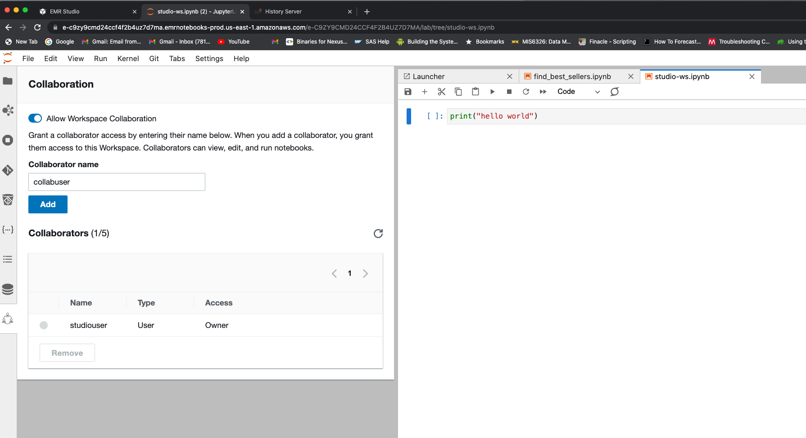

Make sure that the user is added to the workspace collaborators.

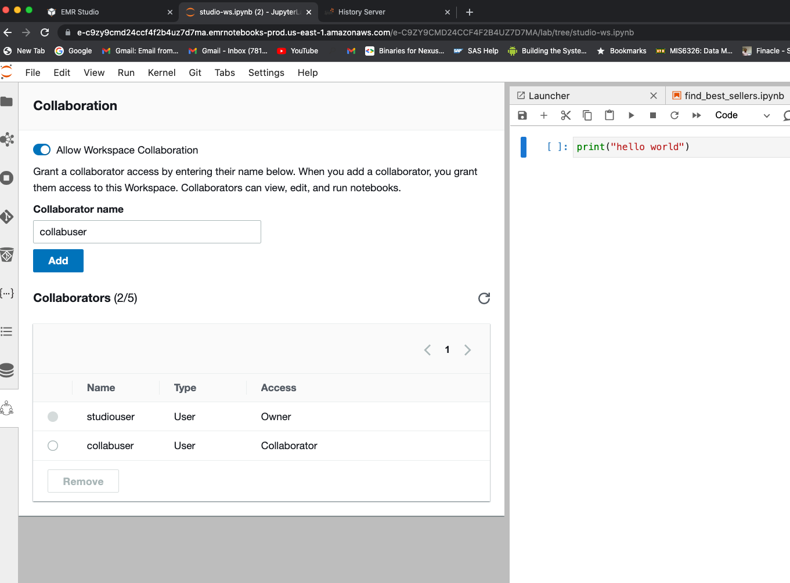

Open another incognito or private window in your browser and paste the Studio access URL (for example: https://es-8QX8R2BETY6B8HA0Y6QM7G6EC.emrstudio-prod.us-east-1.amazonaws.com?locale=en).

Click on Logout and logout as studiouser. Once signed out, do not click on "Log Back In". Paste the Studio access URL again in the same window and you will be re-directed to login page. Enter your event engine AWS account ID. Under IAM user name, enter collab user. Under password, enter "Test123$". Click on sign in.

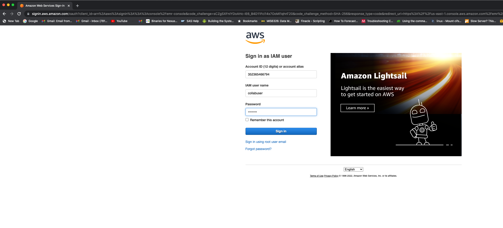

Once logged in, click on the workspace "studio-ws" and open JupyterLab console. Now, open the studio-ws.ipynb file.

Open the two private browsers side by side with one browser session for IAM user "studiouser" and another one for IAM user "collabuser". Hover over the hello world code cell from collabuser's browser and see the user name from the studiouser's browser. Similarly, you can hover over the cell from studiouser's browser and see the user name from the collabuser's browser.

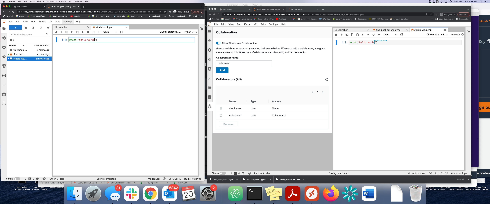

You can also edit the same cell as collabuser and see the changes getting reflected from the studiouser's browser.

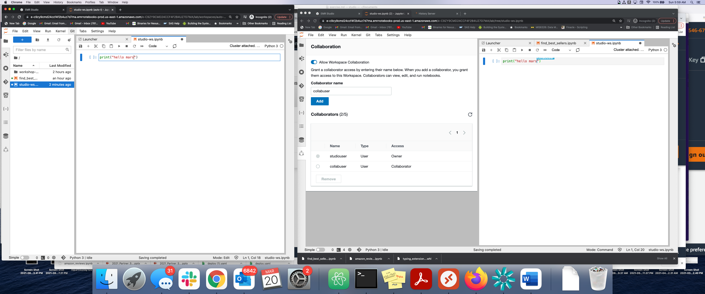

This feature is very useful for collaborating with your team members for live troubleshooting and brainstorming.
