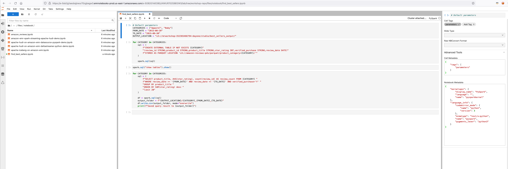

# **Amazon EMR Studio**

### Log in to EMR Studio

In this exercise we will run Spark workflows using EMR Studio with managed Jupyter-based notebooks. We will also cover the most standout features of Amazon EMR Studio.

Go to the [EMR Web Console](https://us-east-1.console.aws.amazon.com/elasticmapreduce/home?region=us-east-1#)
(Right click -> Open Link in New Tab) and navigate to "EMR Studio" on the right hand side. Click on "Get Started".


You will be able to see an EMR Studio created called "workshop-studio". Click on it and in the following page, copy the Studio URL.


Open an incognito or a private browser and paste the URL. In the AWS login page, choose "IAM User" and enter the account ID retrieved from your event engine's AWS Web console. Click on Next.


Under IAM user name, enter  "studiouser". Under password, enter Test123$. Click on Sign in.


You will be logged into the EMR Studio. Users can access this interface without requiring AWS Web Console access. EMR Studio supports both IAM and SSO auth modes.

### Check EMR clusters from EMR Studio

Check the clusters under EMR on EC2. You can filter the clusters. Click on "EMR-Spark-Hive-Presto" and go to "Launch application UI -> Spark History Server".


You will be taken to the EMR Persistent Spark History Server. You can also see the UIs of terminated clusters for up to 60 days after termination.


### Create a Studio Workspace

Go to Workspaces and "Create Workspace".


Enter a workspace name. For example: "studio-ws". Enable "Allow Workspace Collaboration". Under "Advanced Configuration", select "Attach Workspace to an EMR cluster". In the drop down, choose the EMR-Spark-Hive-Presto cluster. Click "Create Workspace".


It will take about 2 minutes for the Status to change to "Attached".  


Click on the workspace and it will open a managed JupyterLab session. You may need to allow pop-up from this address in your browser to open the JupyterLab. Once opened, you can create a Jupyter notebook with any kernel.

### Explore EMR Studio Workspace Features

#### Cluster
Under cluster tab, check the cluster attachment.


Note that you will be able to detach and attach this workspace to a different cluster. For now, you can leave it as is.

#### Git repository
Under Git tab, you can add a Git repository by entering the repository name, URL and credentials. You can access public repositories without any credentials.

Repository name: workshop-repo

Git repository URL: https://github.com/vasveena/amazon-emr-ttt-workshop

Branch: main

Git credentials: Use a public repository without credentials


Once the repository is added, select it from the "Git repositories" drop down. You will see that the Git repository will be linked successfully.


Once its linked, you can go back to the workspace folder. You will find a folder called "workshop-repo".


Go to workshop-repo -> files -> notebook to see the notebooks.


If you are not able to link repository successfully, create 3 nested folders under your workspace root folder: workshop-repo/files/notebook. Create Folder Icon looks like . Download all the .ipynb files from [here](https://github.com/vasveena/amazon-emr-ttt-workshop) to your local desktop. You can download the entire project [Zip File](https://github.com/vasveena/amazon-emr-ttt-workshop/archive/refs/heads/main.zip). Unzip the zip file and go to amazon-emr-ttt-workshop-main/files/notebook. Upload these .ipynb files from your local desktop to the Jupyter interface under the nested folders created (workshop-repo/files/notebook). Upload icon looks like .

**Alternate Option:** Instead of uploading the files manually, you use the below commands on your JumpHost EC2 instance. Connect to your EC2 instance named "JumpHost" using Session Manager and run the below commands.

```
sudo su ec2-user
cd ~

pip3 uninstall awscli -y
pip3 install awscli --upgrade
/home/ec2-user/.local/bin/aws --version
sudo yum install upgrade -y jq

studio_id=$(/home/ec2-user/.local/bin/aws emr --region us-east-1 list-studios --region us-east-1 --query Studios[*].{Studios:StudioId} --output text)
studio_s3_location=$(/home/ec2-user/.local/bin/aws emr --region us-east-1 describe-studio --studio-id $studio_id --query 'Studio.DefaultS3Location' --output text)
studio_notebook_id=$(aws s3 ls $studio_s3_location/e- | sed 's|.*PRE ||g' | sed  's|/||g' | sed  's| ||g')
accountID=$(aws sts get-caller-identity --query "Account" --output text)
clusterArn=`aws kafka list-clusters --region us-east-1 | jq '.ClusterInfoList[0].ClusterArn'`
echo $clusterArn
bs=$(echo "aws kafka get-bootstrap-brokers --cluster-arn ${clusterArn} --region us-east-1"  | bash | jq '.BootstrapBrokerString' | sed 's|"||g')

mkdir -p upload
cd upload

wget https://github.com/vasveena/amazon-emr-ttt-workshop/archive/refs/heads/main.zip
unzip main.zip

sed -i "s|youraccountID|$accountID|g" amazon-emr-ttt-workshop-main/files/notebook/amazon-emr-spark-streaming-apache-hudi-demo.ipynb
sed -i "s|yourbootstrapbrokers|$bs|g" amazon-emr-ttt-workshop-main/files/notebook/amazon-emr-spark-streaming-apache-hudi-demo.ipynb
sed -i "s|youraccountID|$accountID|g" amazon-emr-ttt-workshop-main/files/notebook/apache-hudi-on-amazon-emr-datasource-pyspark-demo.ipynb
sed -i "s|youraccountID|$accountID|g" amazon-emr-ttt-workshop-main/files/notebook/apache-hudi-on-amazon-emr-dml.ipynb
sed -i "s|youraccountID|$accountID|g" amazon-emr-ttt-workshop-main/files/notebook/apache-iceberg-on-amazon-emr.ipynb
sed -i "s|youraccountID|$accountID|g" amazon-emr-ttt-workshop-main/files/notebook/find_best_sellers.ipynb

aws s3 cp amazon-emr-ttt-workshop-main/files/notebook/amazon-emr-spark-streaming-apache-hudi-demo.ipynb $studio_s3_location/$studio_notebook_id/workshop-repo/files/notebook/
aws s3 cp amazon-emr-ttt-workshop-main/files/notebook/apache-hudi-on-amazon-emr-datasource-pyspark-demo.ipynb $studio_s3_location/$studio_notebook_id/workshop-repo/files/notebook/
aws s3 cp amazon-emr-ttt-workshop-main/files/notebook/apache-hudi-on-amazon-emr-dml.ipynb $studio_s3_location/$studio_notebook_id/workshop-repo/files/notebook/
aws s3 cp amazon-emr-ttt-workshop-main/files/notebook/apache-iceberg-on-amazon-emr.ipynb $studio_s3_location/$studio_notebook_id/workshop-repo/files/notebook/
aws s3 cp amazon-emr-ttt-workshop-main/files/notebook/find_best_sellers.ipynb $studio_s3_location/$studio_notebook_id/workshop-repo/files/notebook/
aws s3 cp amazon-emr-ttt-workshop-main/files/notebook/amazon_reviews.ipynb $studio_s3_location/$studio_notebook_id/workshop-repo/files/notebook/
aws s3 cp amazon-emr-ttt-workshop-main/files/notebook/smstudio-pyspark-hive-sentiment-analysis.ipynb $studio_s3_location/$studio_notebook_id/workshop-repo/files/notebook/

```

**Note:** If you ran the above commands, you can skip the below steps and go to [Restart Studio Workspace](#restart-the-studio-workspace) section. If you either uploaded the files manually or if your Git repository linking was successful, continue with the following instructions.

Once you either link the repository or upload the files successfully, go to workshop-repo -> files -> notebook folder and open find_best_sellers.ipynb file. Notice the OUTPUT_LOCATION S3 path in the first cell: *s3://mrworkshop-youraccountID-dayone/studio/best_sellers_output/*.  


Before you start working with these notebooks, let's replace the string "youraccountID" in the S3 locations specified in all the notebooks to make it easy for you while executing the notebook instructions.

For this purpose, close the EMR Studio Workshop Jupyter interface in your browser. Connect to your EC2 instance named "JumpHost" using Session Manager and run the below commands.

```
sudo su ec2-user
cd ~

pip3 uninstall awscli -y
pip3 install awscli --upgrade
/home/ec2-user/.local/bin/aws --version
sudo yum install upgrade -y jq

studio_id=$(/home/ec2-user/.local/bin/aws emr --region us-east-1 list-studios --region us-east-1 --query Studios[*].{Studios:StudioId} --output text)
studio_s3_location=$(/home/ec2-user/.local/bin/aws emr --region us-east-1 describe-studio --studio-id $studio_id --query 'Studio.DefaultS3Location' --output text)
studio_notebook_id=$(aws s3 ls $studio_s3_location/e- | sed 's|.*PRE ||g' | sed  's|/||g' | sed  's| ||g')
accountID=$(aws sts get-caller-identity --query "Account" --output text)
clusterArn=`aws kafka list-clusters --region us-east-1 | jq '.ClusterInfoList[0].ClusterArn'`
echo $clusterArn
bs=$(echo "aws kafka get-bootstrap-brokers --cluster-arn ${clusterArn} --region us-east-1"  | bash | jq '.BootstrapBrokerString' | sed 's|"||g')

mkdir -p studio
cd studio

aws s3 cp $studio_s3_location/$studio_notebook_id/workshop-repo/files/notebook/ . --recursive

sed -i "s|youraccountID|$accountID|g" amazon-emr-spark-streaming-apache-hudi-demo.ipynb
sed -i "s|yourbootstrapbrokers|$bs|g" amazon-emr-spark-streaming-apache-hudi-demo.ipynb
sed -i "s|youraccountID|$accountID|g" apache-hudi-on-amazon-emr-datasource-pyspark-demo.ipynb
sed -i "s|youraccountID|$accountID|g" apache-hudi-on-amazon-emr-dml.ipynb
sed -i "s|youraccountID|$accountID|g" apache-iceberg-on-amazon-emr.ipynb
sed -i "s|youraccountID|$accountID|g" find_best_sellers.ipynb

aws s3 cp amazon-emr-spark-streaming-apache-hudi-demo.ipynb $studio_s3_location/$studio_notebook_id/workshop-repo/files/notebook/
aws s3 cp apache-hudi-on-amazon-emr-datasource-pyspark-demo.ipynb $studio_s3_location/$studio_notebook_id/workshop-repo/files/notebook/
aws s3 cp apache-hudi-on-amazon-emr-dml.ipynb $studio_s3_location/$studio_notebook_id/workshop-repo/files/notebook/
aws s3 cp apache-iceberg-on-amazon-emr.ipynb $studio_s3_location/$studio_notebook_id/workshop-repo/files/notebook/
aws s3 cp find_best_sellers.ipynb $studio_s3_location/$studio_notebook_id/workshop-repo/files/notebook/

```

##### Restart the Studio Workspace

Once the files are uploaded successfully, while logged in as studiouser, from your EMR Studio Console, go to Workspaces. Click on your workspace and under Actions, click on "Stop".


Once the workspace status becomes "Idle" (it will take about 2-3 minutes), while logged in as studiouser, go back to EMR Studio Console -> Workspaces -> Actions again and click on "Start".


Wait for the status to go from "Starting" to "Attached". Once the workspace is in "Attached" state, go back to your EMR Studio Workspace Jupyter interface. Open the find_best_sellers.ipynb notebook (from workshop-repo -> files -> notebooks) and verify that the the account ID in the OUTPUT_LOCATION of the first cell is changed properly.


#### Notebook-scoped libraries

Run all the cells in amazon-reviews.ipynb notebook. Make sure Pyspark kernel is selected.

Notice the notebook scoped libraries installed on SparkContext sc.

```
sc.list_packages()

sc.install_pypi_package("pandas==1.0.1") #Install pandas version 1.0.5
sc.install_pypi_package("numpy==1.20.2") #Intall numpy version 1.19.5
sc.install_pypi_package("matplotlib==3.2.0","https://pypi.org/simple") #Install matplotlib from given PyPI repository

sc.list_packages()
```


You will use these installed dependencies to plot visualizations on top of Amazon Reviews data.


You can have two notebooks within the same workspace with different dependencies. You can even reproduce these dependencies and run the same notebook after your cluster is terminated by attaching it to a different active cluster.

When you are done, terminate the kernel by clicking on stop icon  and restart the kernel by clicking on the restart kernel icon . This will ensure that the Spark session created from this notebook is killed and your EMR cluster's YARN resources will become free.

#### Parameterized notebooks

Open the file find_best_sellers.ipynb. Go to View -> Show Right Sidebar.

Click on the first cell with comment "Default parameters". In the Right Sidebar, click on "Add tag" and  type "parameters" and click "+". Now check the "Advanced Tools" and make sure that the parameters tag is applied to that cell.



Do not create any S3 prefix under the OUTPUT_LOCATION before running the notebook cells.

Run all the cells in the notebook. Once all the blocks are executed in the notebook, make sure the outputs for categories "Apparel" and "Baby" are created under the S3 output location using AWS CLI or [S3 Web Console](https://s3.console.aws.amazon.com/s3/home?region=us-east-1) (Right click -> Open Link in New Tab).


OR run the following commands in EC2 JumpHost session.

```
accountID=$(aws sts get-caller-identity --query "Account" --output text)
aws s3 ls s3://mrworkshop-$accountID-dayone/studio/best_sellers_output/

```

Save the notebook. When you are done, terminate the kernel by clicking on the stop icon  and the restart kernel icon . This will ensure that the Spark session created from this notebook is killed and your EMR cluster's YARN resources will become free.

#### Notebooks API

Let us run the parameterized notebook "find_best_sellers.ipynb" using EMR Notebooks API.

Run the below command with your JumpHost EC2 instance (connected with Session Manager).

```
aws s3 ls s3://amazon-reviews-pds/parquet/product_category

```


You can see the list of categories. From EMR Studio, we ran analysis for categories "Apparel" and "Baby". Now let us run this notebook from API for categories "Furniture" and "PC". You can select whichever categories you want.

Run following commands in your EC2 JumpHost to upgrade your AWS CLI (if not done already).

```
sudo su ec2-user
cd ~

pip3 uninstall awscli -y
pip3 install awscli --upgrade

/home/ec2-user/.local/bin/aws --version

```

Verify that the notebooks APIs are working (if not done already).

```
/home/ec2-user/.local/bin/aws emr --region us-east-1 list-studios

```

Run the following commands to submit a job using EMR Notebooks API.

```
accountID=$(aws sts get-caller-identity --query "Account" --output text)
studio_id=$(/home/ec2-user/.local/bin/aws emr --region us-east-1 list-studios --region us-east-1 --query Studios[*].{Studios:StudioId} --output text)
studio_s3_location=$(/home/ec2-user/.local/bin/aws emr --region us-east-1 describe-studio --studio-id $studio_id --query 'Studio.DefaultS3Location' --output text)
studio_notebook_id=$(aws s3 ls $studio_s3_location/e- | sed 's|.*PRE ||g' | sed  's|/||g' | sed  's| ||g')
cluster_id=$(aws emr list-clusters --region us-east-1 --query 'Clusters[?Name==`EMR-Spark-Hive-Presto` && Status.State!=`TERMINATED`]'.{Clusters:Id} --output text)

notebookExecID=$(/home/ec2-user/.local/bin/aws emr --region us-east-1 \
start-notebook-execution \
--editor-id $studio_notebook_id \
--notebook-params "{\"CATEGORIES\":[\"Furniture\",\"PC\"], \"FROM_DATE\":\"2015-08-27\", \"TO_DATE\":\"2015-08-31\", \"OUTPUT_LOCATION\": \"s3://mrworkshop-$accountID-dayone/studio/best_sellers_output_fromapi/\"}" \
--relative-path workshop-repo/files/notebook/find_best_sellers.ipynb \
--notebook-execution-name demo-execution \
--execution-engine "{\"Id\" : \"${cluster_id}\"}" \
--service-role emrStudioRole | jq -r .NotebookExecutionId)

echo $notebookExecID

```

You will get a NotebookExecutionId in return. Run the following command to get the status of this notebook execution. No need to replace anything in the command.

```
aws emr --region us-east-1 describe-notebook-execution --notebook-execution-id $notebookExecID

```

After about 2-3 minutes, the Status will be FINISHED.

```
aws emr --region us-east-1 describe-notebook-execution --notebook-execution-id $notebookExecID
{
   "NotebookExecution": {
       "Status": "FINISHED",
       "ExecutionEngine": {
           "MasterInstanceSecurityGroupId": "sg-066e6805267d1d69c",
           "Type": "EMR",
           "Id": "j-142PVKGDZTTXS"
       },
       "NotebookParams": "{\"CATEGORIES\":[\"Furniture\",\"PC\"], \"FROM_DATE\":\"2015-08-27\", \"TO_DATE\":\"2015-08-31\", \"OUTPUT_LOCATION\": \"s3://mrworkshop-352365466794-dayone/studio/best_sellers_output_fromapi/\"}",
       "Tags": [],
       "OutputNotebookURI": "s3://studio-352365466794-dayone/notebook/e-C9ZY9CMD24CCF4F2B4UZ7D7MA/executions/ex-J02QDLG4TWXSNWLO4OGZ9NNX609MV/find_best_sellers.ipynb",
       "NotebookExecutionName": "demo-execution",
       "LastStateChangeReason": "Execution is finished for cluster j-142PVKGDZTTXS.",
       "StartTime": 1647768150.761,
       "NotebookExecutionId": "ex-J02QDLG4TWXSNWLO4OGZ9NNX609MV",
       "EndTime": 1647768220.416,
       "EditorId": "e-C9ZY9CMD24CCF4F2B4UZ7D7MA",
       "Arn": "arn:aws:elasticmapreduce:us-east-1:352365466794:notebook-execution/ex-J02QDLG4TWXSNWLO4OGZ9NNX609MV",
       "NotebookInstanceSecurityGroupId": "sg-05e5e70bcaa4a624f"
   }
}

```

Now let us check the S3 output path. You will now see a new prefix called "best_sellers_output_fromapi" with files generated under categories "Furniture" and "PC".


We will see in tomorrow's exercise how to orchestrate a pipeline with this parameterized notebook using Amazon Managed Workflows for Apache Airflow.

#### SQL Explorer

Lets check the new SQL explorer feature which helps you run ad-hoc and interactive queries against your tables.

Go to the SQL explorer and select "default" database. You will be able to see the four tables created in Glue catalog for the 4 categories apparel, baby, furniture and PC from our previous job runs.


Click on "Open Editor" and query the tables.

```
select * from default.baby limit 10;

```


#### Collaborators

Workspace collaboration is a new feature introduced in EMR Studio. Currently, we are logged in as studiouser.

Go to the root folder and choose studio-ws.ipynb which is the default notebook created for this workspace. You can choose any kernel. Let us choose Python3 kernel for this time. Type the following command on the cell.

```
print("hello world")

```


Now go to the Collaborators section and add the IAM user "collabuser".


Make sure that the user is added to the workspace collaborators.


Open another incognito or private window in your browser and paste the Studio access URL (for example: https://es-8QX8R2BETY6B8HA0Y6QM7G6EC.emrstudio-prod.us-east-1.amazonaws.com?locale=en).

Click on Logout and logout as studiouser. Once signed out, do not click on "Log Back In". Paste the Studio access URL again in the same window and you will be re-directed to login page. Enter your event engine AWS account ID. Under IAM user name, enter collab user. Under password, enter "Test123$". Click on sign in.


Once logged in, click on the workspace "studio-ws" and open JupyterLab console. Now, open the studio-ws.ipynb file.

Open the two private browsers side by side with one browser session for IAM user "studiouser" and another one for IAM user "collabuser". Hover over the hello world code cell from collabuser's browser and see the user name from the studiouser's browser. Similarly, you can hover over the cell from studiouser's browser and see the user name from the collabuser's browser.


You can also edit the same cell as collabuser and see the changes getting reflected from the studiouser's browser.


This feature is very useful for collaborating with your team members for live troubleshooting and brainstorming.
