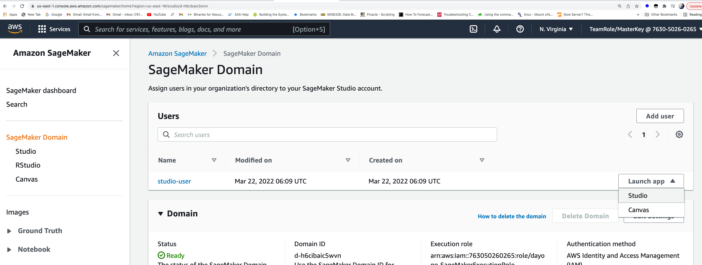
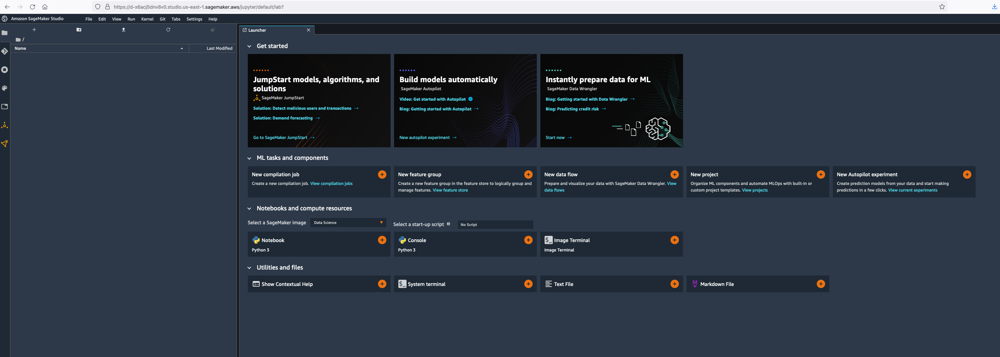
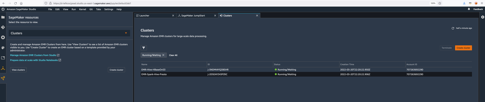
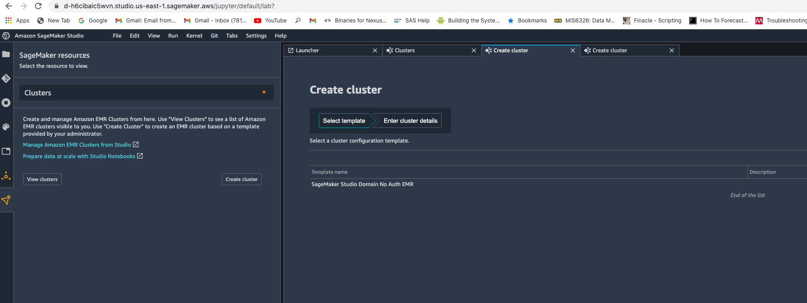
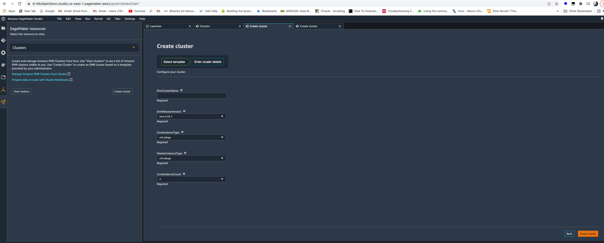
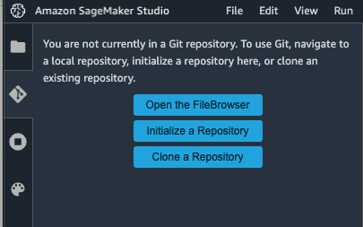
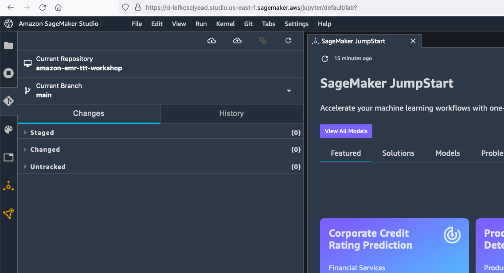
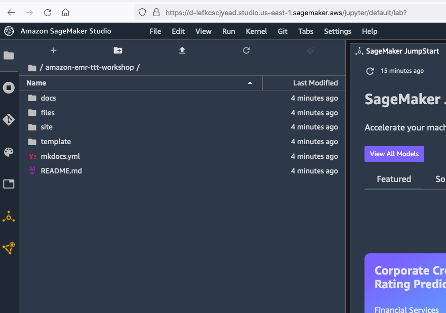
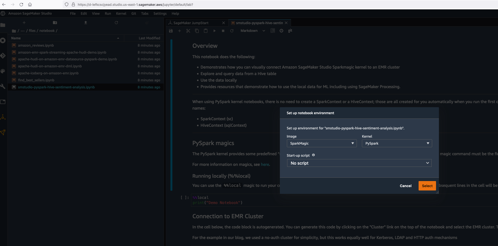
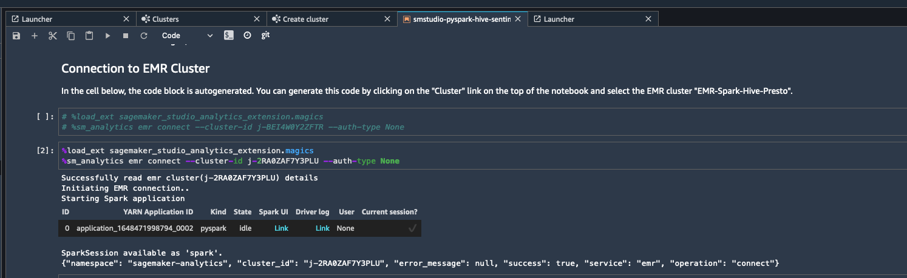

# **Sagemaker Studio Integration with Amazon EMR**

Amazon Sagemaker provides native integration with Amazon EMR from Sagemaker Studio so that you can run data preparation tasks for your machine learning workloads using EMR from Sagemaker.

### Login to the Sagemaker Studio

Go to the Amazon Sagemaker Web Console -> Get started -> Sagemaker Studio

You should see the Sagemaker domain ready status. Launch the Sagemaker Studio from Launch app -> Studio.

It will take about 2 minutes to initialize after which you will be taken to the Sagemaker Studio interface.

Once you are in, carry on with rest of the steps.

### Explore EMR clusters in Sagemaker Studio

Click on the  icon and choose Clusters from the Sagemaker resources drop down. You will be able to see the EMR clusters.

You can filter the EMR clusters and also create a new one with a cluster template created from AWS Service Catalog. Go to Clusters -> Create cluster. You will be able to see a template.

When you select the template, it will show you the blueprint for your EMR cluster creation.

For now, let's use our existing cluster.

### Connect to EMR cluster from Sagemaker Studio and run data processing jobs

Go to Git repository section and click on Clone the repository.

Specify the repository to clone: https://github.com/vasveena/amazon-emr-ttt-workshop.git

Make sure that the repository is cloned.

Go to Files section (folder icon on the left hand side pane).

Go to the directory files -> notebook -> smstudio-pyspark-hive-sentiment-analysis.ipynb. Choose the SparkMagic Kernel when prompted and click "Select".

It will take a few minutes for the kernel to initialize. Once the kernel starts, go to Cluster on the top right corner and choose the EMR cluster "EMR-Spark-Hive-Presto". When it asks for credential type, choose "No credential" and Connect. Now, a Spark application will be created.

Now, you can run the remaining code blocks of the notebook which will perform data transformations and explorations using the EMR cluster and create and host an ML model using Sagemaker.
