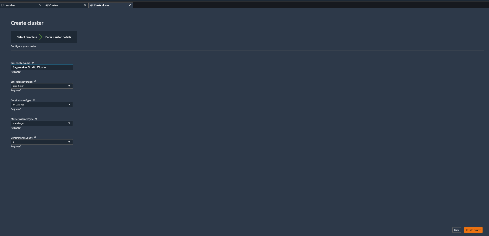

# **Sagemaker Studio Integration with Amazon EMR**

Amazon Sagemaker provides native integration with Amazon EMR from Sagemaker Studio so that you can run data preparation tasks for your machine learning workloads using EMR from Sagemaker.

### Login to the Sagemaker Studio

Go to the [Amazon Sagemaker Web Console](https://us-east-1.console.aws.amazon.com/sagemaker/home?region=us-east-1#) -> Get started -> Sagemaker Studio

You should see the Sagemaker domain ready status. Launch the Sagemaker Studio from Launch app -> Studio.

It will take about 2 minutes to initialize after which you will be taken to the Sagemaker Studio interface.

Once you are in, carry on with rest of the steps.

### Create EMR Cluster from Sagemaker Studio

Click on the  icon and choose Clusters from the Sagemaker resources drop down. You will be able to see the EMR clusters. You can filter the EMR clusters.

Now, create a new EMR cluster with a cluster template created from AWS Service Catalog.

Go to Clusters -> Create cluster. You will be able to see a template.

When you click on the template and click "Select Template", it will show you the blueprint for your EMR cluster creation.

Enter a cluster name (for eg: "Sagemaker Studio Cluster"). You can keep everything else as default. Click on "Create Cluster".

You can go to the [AWS CloudFormation Web Console](https://us-east-1.console.aws.amazon.com/cloudformation/home?region=us-east-1#/stacks?filteringStatus=active&filteringText=&viewNested=true&hideStacks=false&stackId=) (Right click -> Open Link in New Tab). You will be able to see the stack launched by AWS Service Catalog from our Create Cluster action.

Wait for the stack to complete and for the cluster "Sagemaker Studio Cluster" to get created. It will take about 15 mins. Once its complete, you will see the below message in your Sagemaker Studio.

You will also see that an EMR cluster called "Sagemaker Studio Cluster" is created in the [EMR Web Console](https://us-east-1.console.aws.amazon.com/elasticmapreduce/home?region=us-east-1#) (Right click -> Open Link in New Tab)

Please note we are not using one of the existing EMR clusters because this Studio was created in a different VPC and we have not established peering between the two VPCs.

### Connect to EMR cluster from Sagemaker Studio and run data processing jobs

Go to Git repository section and click on Clone the repository.

Specify the repository to clone: https://github.com/vasveena/amazon-emr-ttt-workshop.git

Make sure that the repository is cloned.

Go to Files section (folder icon on the left hand side pane).

Go to the directory files -> notebook -> smstudio-pyspark-hive-sentiment-analysis.ipynb. PySpark Kernel should be chosen automatically for this notebook. If promoted, choose the SparkMagic Kernel and click "Select".

It will take a few minutes for the kernel to initialize. Once the kernel starts, go to Cluster on the top right corner and choose the EMR cluster "Sagemaker Studio Cluster".

When it prompts for credential type, choose "No credential" and Connect.

Once you connect, a Spark application will be created automatically.

After the Spark application is created successfully and you have the YARN application ID for the Spark session like in the above screenshot, you can run the remaining code blocks of the notebook which will perform data transformations and explorations using the EMR cluster and create and host an ML model using Sagemaker.
