# **Amazon EMR on EKS**

In this exercise, you will run Spark applications using EMR on EKS. For this exercise, we are going to use an EKS cluster created using the CloudFormation template. If you are interested in building this environment end-to-end, you can do that following the first 10 steps (until line 131) in this [note](https://github.com/vasveena/EMROnEKS/blob/main/emroneks-note).

### Create the EMR on EKS virtual clusters

Go to the [CloudFormation Web Console](https://us-east-1.console.aws.amazon.com/cloudformation/home?region=us-east-1#/stacks?filteringStatus=active&filteringText=&viewNested=true&hideStacks=false) (Right click -> Open Link in New Tab) and see if you have the CloudFormation stack named "emr-on-eks" deployed in your AWS event engine accounts.


Now go to the EC2 and search for "jumphost". Choose the instance starting with the name "emr-on-eks-PrepStack". Connect to this instance using Session Manager.


Once you are inside the session manager, do NOT switch to the ec2-user. Export the AWS credentials of your AWS event engine accounts (follow the step 6 of [Setup](/setup)).

```
export AWS_DEFAULT_REGION=us-east-1
export AWS_ACCESS_KEY_ID=<redacted>
export AWS_SECRET_ACCESS_KEY=<redacted>
export AWS_SESSION_TOKEN=<redacted>

```

Next, run the following command to configure the Kubernetes client (kubectl) and download the certificate from the Amazon EKS control plane for authentication.

```

sudo sed -i 's|<REGION>|us-east-1|g' /tmp/aws-logging-cloudwatch-configmap.yaml
sudo sed -i 's|auto_create_group On|auto_create_group true|g' /tmp/aws-logging-cloudwatch-configmap.yaml

sh /tmp/kubeconfig.sh

```

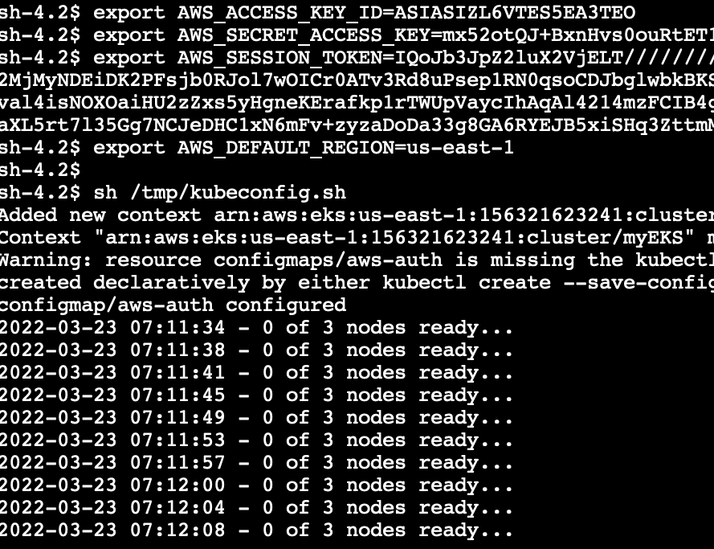

It will take about 2 mins to complete. Once done, you will see the 3 nodes of the deployed EKS cluster in ready status.


Go to the [EKS Web console](https://us-east-1.console.aws.amazon.com/eks/home?region=us-east-1#/clusters) (Right click -> Open Link in New Tab) and check the cluster myEKS.


Click on the cluster and look at the 3 EC2 nodes in the Overview section. These are the EC2 instances of the EKS cluster.


Go to Configuration -> Compute and scroll down to see the Fargate profile attached to the EKS cluster.


Run the following command to register the EKS namespace backed by EC2 instances with an EMR virtual cluster.

```
sh /tmp/emroneks.sh ec2-ns ec2-vc

```

Run the following command to register the EKS namespace backed by Fargate profile with another EMR virtual cluster.

```

sh /tmp/emroneks-fargate.sh fargate-vc

```

You can now go to the [EMR Web Console](https://us-east-1.console.aws.amazon.com/elasticmapreduce/home?region=us-east-1#) (Right click -> Open Link in New Tab). On the bottom left side pane, you will be able to see the "EMR on EKS" section. Click on Virtual clusters. You can see the two EMR on EKS virtual clusters created for EC2 and Fargate namespaces respectively. Virtual clusters do not run any resources.

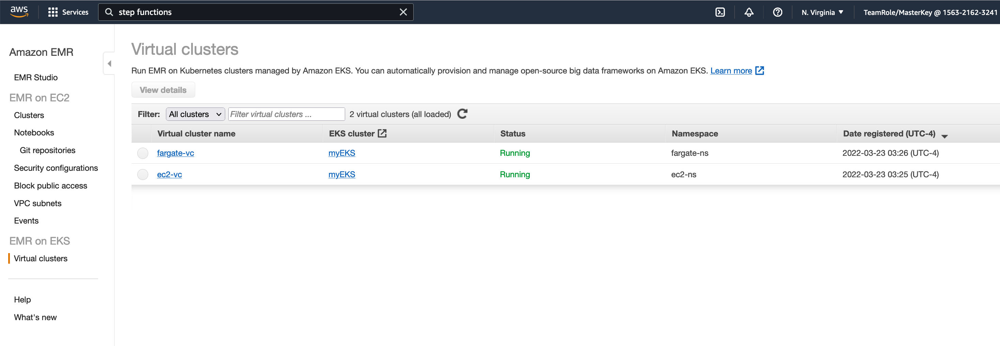

### Build the Cloud9 workspace

We will use Cloud9 to observe Kubernetes dashboards. Go to the [Cloud9 Web Console](https://us-east-1.console.aws.amazon.com/cloud9/home/product) (Right click -> Open Link in New Tab) -> Create environment.

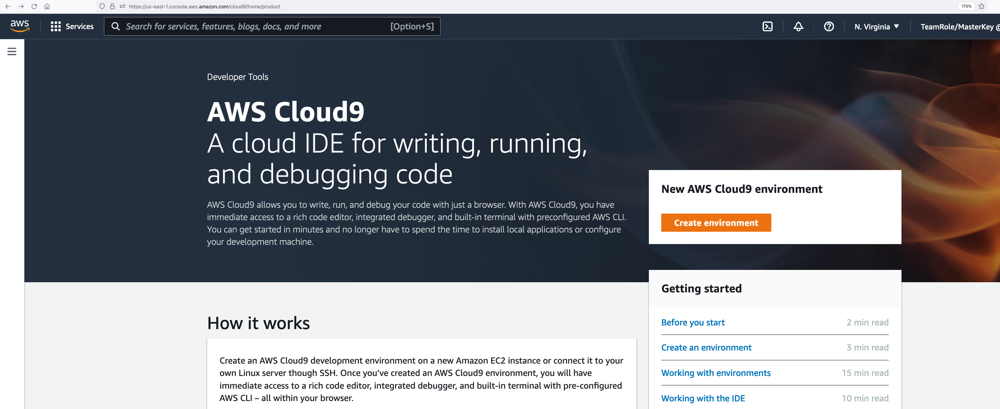

In Step 1, name your environment like "emr-on-eks-platform".

In Step 2, choose t3.small for instance type. Leave the values for Environment type, Instance type, Platform defaulted. Choose Network settings (advanced) and choose VPC. Select the VPC starting with the name "emr-on-eks-EksStack".


Go to Next Step and create environment. This will take a few minutes.

Once the environment is created, click on the grey circle button in top right corner and select Manage EC2 Instance.


You will be taken to the cloud9 instance in the EC2 console. Select the instance, then choose Actions / Security / Modify IAM Role.


Select the IAM role that looks like "emr-on-eks-PrepStack-XXXX-rJumpHostInstanceProfile" and Save.


Now return to your Cloud9 workspace and click the gear icon in top right corner.

Select AWS SETTINGS. Turn off AWS managed temporary credentials. Close the Preferences tab.


### Install Tools

Let's install eksctl and kubectl in our Cloud9 environment. Kubernetes uses a command line utility called kubectl for communicating with the cluster API server. eksctl is a simple CLI tool for creating and managing EKS clusters.

Run the following commands in your Cloud9 IDE. You can expand the bash screen for better visibility.

Upgrade your AWS CLI.

```
pip3 install awscli --upgrade --user

```

Install eksctl with following commands.

```
curl --silent --location "https://github.com/weaveworks/eksctl/releases/latest/download/eksctl_$(uname -s)_amd64.tar.gz" | tar xz -C /tmp

sudo mv /tmp/eksctl /usr/local/bin

eksctl version

```

Install kubectl with following commands and associate it with the EKS cluster.

```

curl -o kubectl https://amazon-eks.s3.us-west-2.amazonaws.com/1.19.6/2021-01-05/bin/linux/amd64/kubectl

chmod +x ./kubectl

mkdir -p $HOME/bin && cp ./kubectl $HOME/bin/kubectl && export PATH=$PATH:$HOME/bin

echo 'export PATH=$PATH:$HOME/bin' >> ~/.bashrc

kubectl version --short --client

aws eks update-kubeconfig --region us-east-1 --name myEKS

kubectl get nodes -o wide

```

The last command should display the EC2 nodes of your EKS cluster.

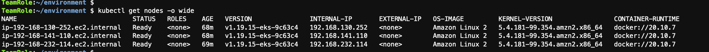

Similarly, running the eksctl get cluster command should display the myEKS cluster.

```
eksctl get cluster --region us-east-1

```


Run the following command and see if the EMR on EKS clusters we created are getting listed.

```
aws emr-containers list-virtual-clusters --region us-east-1

```

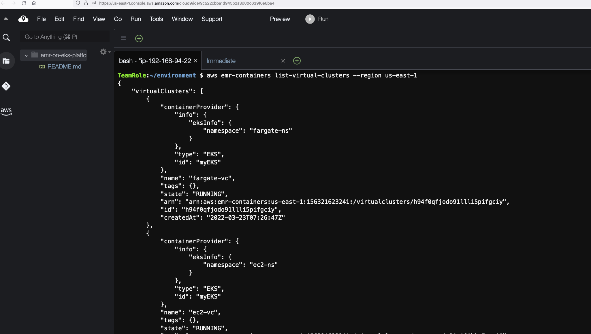

### Submit jobs using EMR on EKS  

Now, lets submit jobs to these clusters. For that, we are going to use [EMR Containers](https://docs.aws.amazon.com/cli/latest/reference/emr-containers/index.html) API.

To make it easy, lets assign variables to be used in these APIs.

```
sudo yum install -y jq

ec2_vc=$(aws emr-containers list-virtual-clusters --region us-east-1 | jq -r .'virtualClusters[] | select(.name == "ec2-vc") | .id')

fargate_vc=$(aws emr-containers list-virtual-clusters --region us-east-1 | jq -r .'virtualClusters[] | select(.name == "fargate-vc") | .id')

emrOnEksExecRoleArn=$(aws iam list-roles | jq -r .'Roles[] | select(.RoleName | endswith("-EMRExectionRole")) | .Arn')

accountID=$(aws sts get-caller-identity --query Account --output text)

```

### Submit jobs to EC2 namespace

Let us submit a Spark job to the EMR on EKS cluster with namespace attached to the EC2 node group. No need to change anything since we have used variables.

```
aws emr-containers start-job-run --virtual-cluster-id ${ec2_vc} \
--name spark-pi-6.5 \
--execution-role-arn ${emrOnEksExecRoleArn} \
--release-label emr-6.5.0-latest \
--job-driver '{
    "sparkSubmitJobDriver": {
        "entryPoint": "s3://aws-data-analytics-workshops/emr-eks-workshop/scripts/pi.py",
        "sparkSubmitParameters": "--conf spark.executor.instances=2 --conf spark.executor.memory=2G --conf spark.executor.cores=2 --conf spark.driver.cores=1"
        }
    }' \
--configuration-overrides '{"monitoringConfiguration": {"cloudWatchMonitoringConfiguration": {"logGroupName": "emroneks"}}}' \
--region us-east-1

```

You should get the below response.

{
    "virtualClusterId": "vaqteerxju21c161kkr7awe00",
    "arn": "arn:aws:emr-containers:us-east-1:156321623241:/virtualclusters/vaqteerxju21c161kkr7awe00/jobruns/00000002vtm1d42gmtd",
    "id": "00000002vtm1d42gmtd",
    "name": "spark-pi-6.5"
}

Right after this, execute the below command to see what happens on the EC2 namespace in your EKS cluster.

```
kubectl get pods -n ec2-ns --watch

```

Almost immediately you will see EMR virtual cluster will create driver and executor pods on the EC2 namespace of your EKS cluster.


Check the job in the [EMR Web Console](https://us-east-1.console.aws.amazon.com/elasticmapreduce/home?region=us-east-1#virtual-cluster-list:) (Right click -> Open Link in New Tab) -> ec2-vc. You will see that the job is completed.

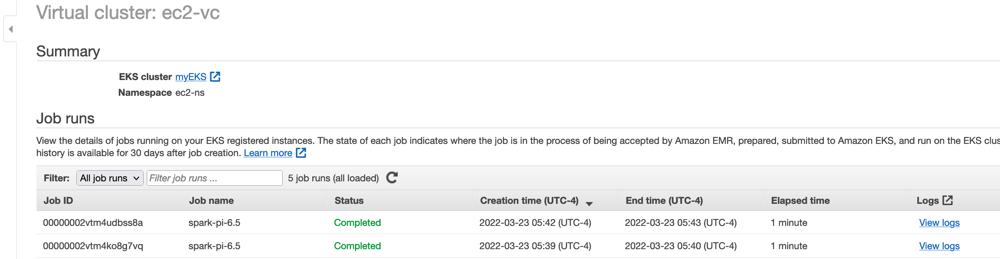

Click on "View Logs" to open the persistent Spark history server.


You can also check the Spark job logs by going to [CloudWatch Web Console](https://us-east-1.console.aws.amazon.com/cloudwatch/home?region=us-east-1#home:) (Right click -> Open Link in New Tab) and clicking on "Log groups". You will see there is a log group called "emroneks".

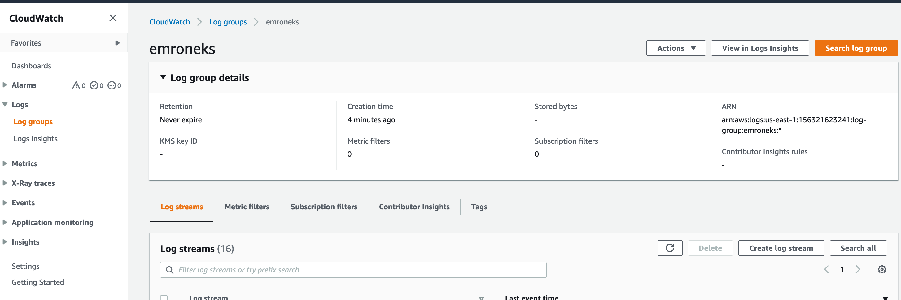

You can see the driver and executor logs.


### Pass Advanced Configs as JSON to the API

Let's run a Spark ETL job with Glue metastore integration and configure it to send driver and executor logs to S3 and Cloudwatch log group.

This is the ETL job (spark-etl-glue.py) we are going to use which will read data, do some basic transformations and write the output to a table on AWS Glue data catalog. This code is just for your reference.

```
import sys
from datetime import datetime

from pyspark.sql import SparkSession
from pyspark.sql import SQLContext
from pyspark.sql.functions import *

if __name__ == "__main__":

    print(len(sys.argv))
    if (len(sys.argv) != 4):
        print("Usage: spark-etl-glue [input-folder] [output-folder] [dbName]")
        sys.exit(0)

    spark = SparkSession\
        .builder\
        .appName("Python Spark SQL Glue integration example")\
        .enableHiveSupport()\
        .getOrCreate()

    nyTaxi = spark.read.option("inferSchema", "true").option("header", "true").csv(sys.argv[1])

    updatedNYTaxi = nyTaxi.withColumn("current_date", lit(datetime.now()))

    updatedNYTaxi.printSchema()

    print(updatedNYTaxi.show())

    print("Total number of records: " + str(updatedNYTaxi.count()))

    updatedNYTaxi.write.parquet(sys.argv[2])

    updatedNYTaxi.registerTempTable("ny_taxi_table")

    dbName = sys.argv[3]
    spark.sql("CREATE database if not exists " + dbName)
    spark.sql("USE " + dbName)
    spark.sql("CREATE table if not exists ny_taxi_parquet USING PARQUET LOCATION '" + sys.argv[2] + "' AS SELECT * from ny_taxi_table ")

```

We will create a JSON with all the configurations we need using the below command.

```
sudo tee ./emroneks-config.json >/dev/null <<EOF
{
"name": "spark-glue-integration-and-s3-log",
"virtualClusterId": "${ec2_vc}",
"executionRoleArn": "${emrOnEksExecRoleArn}",
"releaseLabel": "emr-6.5.0-latest",
"jobDriver": {
"sparkSubmitJobDriver": {
"entryPoint": "s3://aws-data-analytics-workshops/emr-eks-workshop/scripts/spark-etl-glue.py",
"entryPointArguments": [
"s3://aws-data-analytics-workshops/shared_datasets/tripdata/","s3://mrworkshop-$accountID-dayone/taxi-data-glue/","tripdata"
],
"sparkSubmitParameters": "--conf spark.driver.cores=1 --conf spark.executor.memory=2G --conf spark.driver.memory=2G --conf spark.executor.cores=2"
}
},
"configurationOverrides": {
"applicationConfiguration": [{
"classification": "spark-defaults",
"properties": {
"spark.dynamicAllocation.enabled": "false",
"spark.hadoop.hive.metastore.client.factory.class":"com.amazonaws.glue.catalog.metastore.AWSGlueDataCatalogHiveClientFactory"
}
},
{
"classification": "spark-log4j",
"properties": {
"log4j.rootCategory": "DEBUG, console"
}
}
],
"monitoringConfiguration": {
"cloudWatchMonitoringConfiguration": {
"logGroupName": "emroneks"
},
"s3MonitoringConfiguration": {
"logUri": "s3://mrworkshop-$accountID-dayone/emroneks/logs/"
}
}
}
}
EOF

```

Now you can pass the config file we created in your API.

```
aws emr-containers start-job-run --cli-input-json file://emroneks-config.json --region us-east-1

```

You can find the Spark driver and executor pod logs in S3 for the above job.


You can also see the table "ny_taxi_parquet" in database "tripdata" created in AWS Glue data log. Go to [Athena Web Console](https://us-east-1.console.aws.amazon.com/athena/home?region=us-east-1#/query-editor) and see the table under database "tripdata". Since this is the first time we are using Athena, in order to run queries, you need to go to the Settings -> Manage add an S3 location in your account to save your query results. For example: s3://mrworkshop-<accountID>-dayone/athena/.

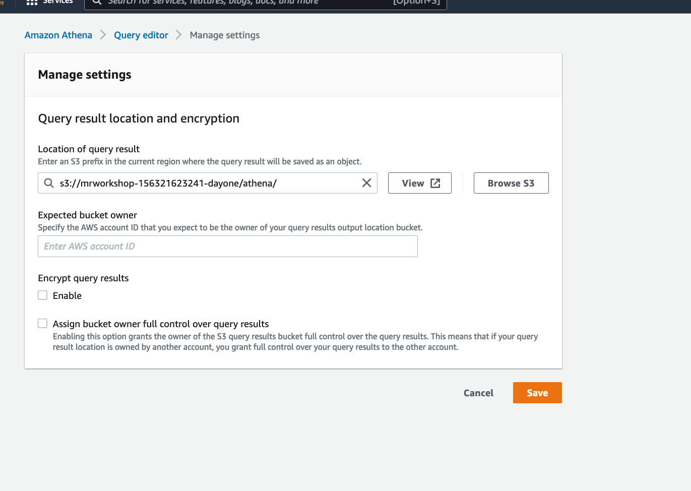

You can query the table now.

```
select * from tripdata.ny_taxi_parquet limit 10;

```


### Change EMR Release Label

One of the important features with EMR on EKS is the ability to change major and minor versions per release label. So far we submitted jobs using EMR 6.5.0 label. Let's now submit the jobs to other release labels.  

Let's submit a job to EMR 5.34.0 label.

```
aws emr-containers start-job-run --virtual-cluster-id ${ec2_vc} \
--name spark-pi-5.34 \
--execution-role-arn ${emrOnEksExecRoleArn} \
--release-label emr-5.34.0-latest \
--job-driver '{
    "sparkSubmitJobDriver": {
        "entryPoint": "s3://aws-data-analytics-workshops/emr-eks-workshop/scripts/pi.py",
        "sparkSubmitParameters": "--conf spark.executor.instances=2 --conf spark.executor.memory=2G --conf spark.executor.cores=2 --conf spark.driver.cores=1"
        }
    }' \
--configuration-overrides '{"monitoringConfiguration": {"cloudWatchMonitoringConfiguration": {"logGroupName": "emroneks"}}}' \
--region us-east-1

```

Similarly, you can change the minor versions also. Let's submit the same job to EMR 6.2.0.

```
aws emr-containers start-job-run --virtual-cluster-id ${ec2_vc} \
--name spark-pi-6.2 \
--execution-role-arn ${emrOnEksExecRoleArn} \
--release-label emr-6.2.0-latest \
--job-driver '{
    "sparkSubmitJobDriver": {
        "entryPoint": "s3://aws-data-analytics-workshops/emr-eks-workshop/scripts/pi.py",
        "sparkSubmitParameters": "--conf spark.executor.instances=2 --conf spark.executor.memory=2G --conf spark.executor.cores=2 --conf spark.driver.cores=1"
        }
    }' \
--configuration-overrides '{"monitoringConfiguration": {"cloudWatchMonitoringConfiguration": {"logGroupName": "emroneks"}}}' \
--region us-east-1

```

Notice the jobs in [EMR on EKS console](https://us-east-1.console.aws.amazon.com/elasticmapreduce/home?region=us-east-1#virtual-cluster-list:) (Right click -> Open Link in New Tab). We are consolidating jobs from different versions in the same infrastructure on EKS.

### Submit serverless Spark jobs using Fargate

So far we were using EC2 namespace to submit jobs. We have an EMR on EKS virtual cluster created for Fargate namespace as well. Let's submit serverless Spark jobs using Fargate.

Run the below command. Notice that for --virtual-cluster-id we are passing the EMR on EKS cluster mapped to Fargate namespace.

```
aws emr-containers start-job-run --virtual-cluster-id ${fargate_vc} \
--name spark-pi-5.34 \
--execution-role-arn ${emrOnEksExecRoleArn} \
--release-label emr-5.34.0-latest \
--job-driver '{
    "sparkSubmitJobDriver": {
        "entryPoint": "s3://aws-data-analytics-workshops/emr-eks-workshop/scripts/pi.py",
        "sparkSubmitParameters": "--conf spark.executor.instances=2 --conf spark.executor.memory=2G --conf spark.executor.cores=2 --conf spark.driver.cores=1"
        }
    }' \
--configuration-overrides '{"monitoringConfiguration": {"cloudWatchMonitoringConfiguration": {"logGroupName": "emroneks"}}}' \
--region us-east-1

```

You will see the job being submitted to Fargate virtual cluster.


Now go to the [EKS Web console](https://us-east-1.console.aws.amazon.com/eks/home?region=us-east-1#/clusters) (Right click -> Open Link in New Tab) -> Overview. In about a minute, you will see that the fargate resource has come up to run this job. Fargate automatically scales up and down based on your processing requirements.


### Deploy Kubernetes Dashboard

Kubernetes Dashboard is a web-based user interface. You can use Dashboard to get an overview of applications running on your cluster. In this lab we will deploy the official Kubernetes Dashboard. Check the documentation [here](https://kubernetes.io/docs/tasks/access-application-cluster/web-ui-dashboard/).

To deploy the dashboard, run the following command:

```
export DASHBOARD_VERSION="v2.0.0"
kubectl apply -f https://raw.githubusercontent.com/kubernetes/dashboard/${DASHBOARD_VERSION}/aio/deploy/recommended.yaml

```

You can access Dashboard using the kubectl command-line tool by running the following command in your Cloud9 terminal. This will start the proxy on port 8080.

```
kubectl proxy --port=8080 --address=0.0.0.0 --disable-filter=true &

```

In your Cloud9 workspace, click Tools / Preview / Preview Running Application. Scroll to the end of the browser address URL and append the following:

```
/api/v1/namespaces/kubernetes-dashboard/services/https:kubernetes-dashboard:/proxy/

```


You will see the Kubernetes dashboard asking for token.

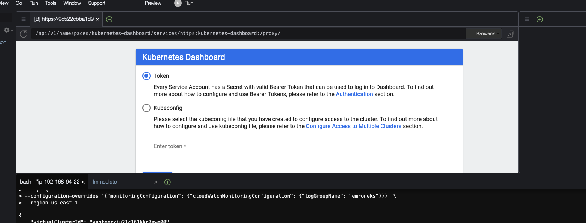

Once you have the login screen in the Cloud9 preview browser tab, press the Pop Out button  to open the login screen in a regular browser tab, like below:

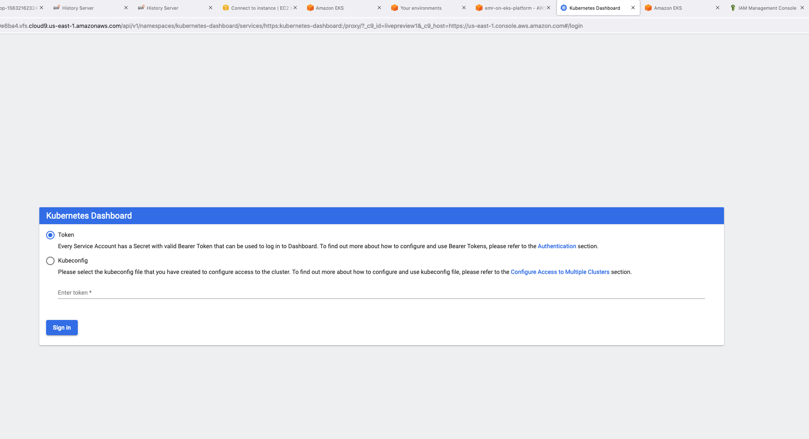

To get the token, you need to create an EKS admin account. Let's do that by running following commands on Cloud9.

```
sudo tee ./eks-admin-service-account.yaml >/dev/null <<EOF
apiVersion: v1
kind: ServiceAccount
metadata:
  name: eks-admin
  namespace: kube-system
---
apiVersion: rbac.authorization.k8s.io/v1beta1
kind: ClusterRoleBinding
metadata:
  name: eks-admin
roleRef:
  apiGroup: rbac.authorization.k8s.io
  kind: ClusterRole
  name: cluster-admin
subjects:
- kind: ServiceAccount
  name: eks-admin
  namespace: kube-system
EOF

kubectl apply -f eks-admin-service-account.yaml

```

Now, run the below command in Cloud9 and paste the "token" of the output on to your browser where it prompts you to enter token.

```
kubectl -n kube-system describe secret $(kubectl -n kube-system get secret | grep eks-admin | awk '{print $1}')

```

You will now be able to see the dashboard.

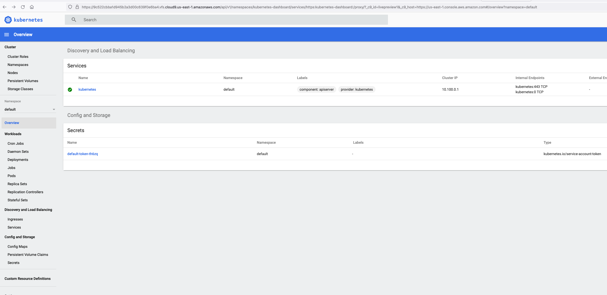

Submit a job again.

```
aws emr-containers start-job-run --virtual-cluster-id ${fargate_vc} \
--name spark-pi-5.34 \
--execution-role-arn ${emrOnEksExecRoleArn} \
--release-label emr-5.34.0-latest \
--job-driver '{
    "sparkSubmitJobDriver": {
        "entryPoint": "s3://aws-data-analytics-workshops/emr-eks-workshop/scripts/pi.py",
        "sparkSubmitParameters": "--conf spark.executor.instances=2 --conf spark.executor.memory=2G --conf spark.executor.cores=2 --conf spark.driver.cores=1"
        }
    }' \
--configuration-overrides '{"monitoringConfiguration": {"cloudWatchMonitoringConfiguration": {"logGroupName": "emroneks"}}}' \
--region us-east-1

```

Explore the dashboard.

### Orchestrate jobs on EMR on EKS using Amazon MWAA

Let's submit (or orchestrate) jobs to EMR on EKS through Amazon MWAA. Go to the [MWAA Web Console](https://us-east-1.console.aws.amazon.com/mwaa/home?region=us-east-1#environments) (Right click -> Open Link in New Tab). You will find a new environment starting with name "emr-on-eks-MWAAStack". Open the airflow UI.

You will see two DAGs. One for EC2 namespace and one for fargate namespace.

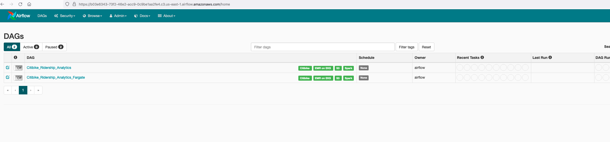

Toggle the DAGs ON and trigger the DAGs manually. This job copies, unzips and transforms files from S3 and then runs some analytics on top of this transformed data.


This DAG takes about 10-12 mins end-to-end. You can check the status in [EMR on EKS console](https://us-east-1.console.aws.amazon.com/elasticmapreduce/home?region=us-east-1#virtual-cluster-list:) (Right click -> Open Link in New Tab).


### Single AZ placement

Our EMR on EKS cluster uses two AZs: us-east-1a and us-east-1b. Go to the Nodes section in Kubernetes dashboard to see which EC2 nodes belong to which AZ. This provides resiliency when compared to EMR on EC2 which runs on a single AZ. However, cross-AZ communication may impact performance and cost. You can define topology for your jobs and instruct all pods to launch in a single AZ. Let's see an example.

```
aws emr-containers start-job-run --virtual-cluster-id ${ec2_vc} \
--name spark-single-az-us-east-1a \
--execution-role-arn ${emrOnEksExecRoleArn} \
--release-label emr-5.34.0-latest \
--job-driver '{
    "sparkSubmitJobDriver": {
        "entryPoint": "s3://aws-data-analytics-workshops/emr-eks-workshop/scripts/pi.py",
        "sparkSubmitParameters": "--conf spark.kubernetes.node.selector.topology.kubernetes.io/zone='us-east-1a' --conf spark.executor.instances=1 --conf spark.executor.memory=2G --conf spark.executor.cores=2 --conf spark.driver.cores=1"
        }
    }' \
--configuration-overrides '{"monitoringConfiguration": {"cloudWatchMonitoringConfiguration": {"logGroupName": "emroneks"}}}' \
--region us-east-1


```

Check the Pods section of Kubernetes dashboard. You will see that the pods are launched only on nodes running in us-east-1a.


You can test the same command by substituting us-east-1a with us-east-1b and see how the pods are getting placed in your Kubernetes dashboard.

```

aws emr-containers start-job-run --virtual-cluster-id ${ec2_vc} \
--name spark-single-az-us-east-1a \
--execution-role-arn ${emrOnEksExecRoleArn} \
--release-label emr-5.34.0-latest \
--job-driver '{
    "sparkSubmitJobDriver": {
        "entryPoint": "s3://aws-data-analytics-workshops/emr-eks-workshop/scripts/pi.py",
        "sparkSubmitParameters": "--conf spark.kubernetes.node.selector.topology.kubernetes.io/zone='us-east-1b' --conf spark.executor.instances=1 --conf spark.executor.memory=2G --conf spark.executor.cores=2 --conf spark.driver.cores=1"
        }
    }' \
--configuration-overrides '{"monitoringConfiguration": {"cloudWatchMonitoringConfiguration": {"logGroupName": "emroneks"}}}' \
--region us-east-1

```
