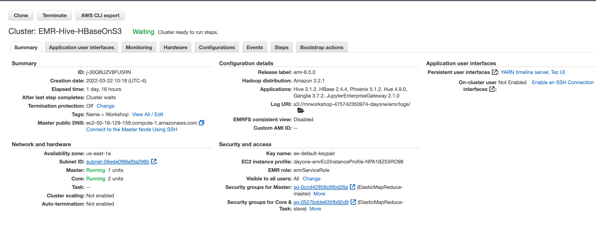
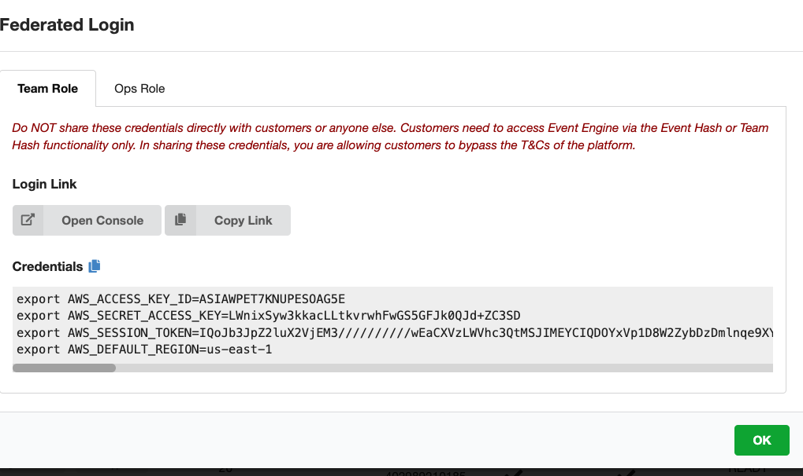
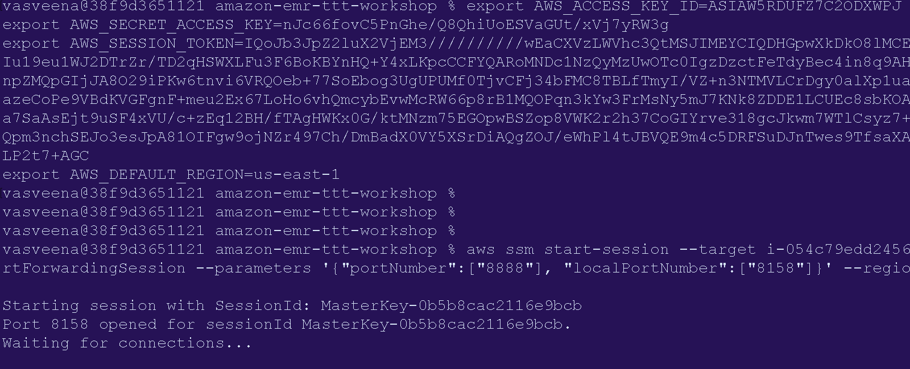
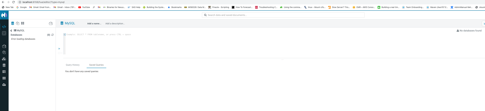
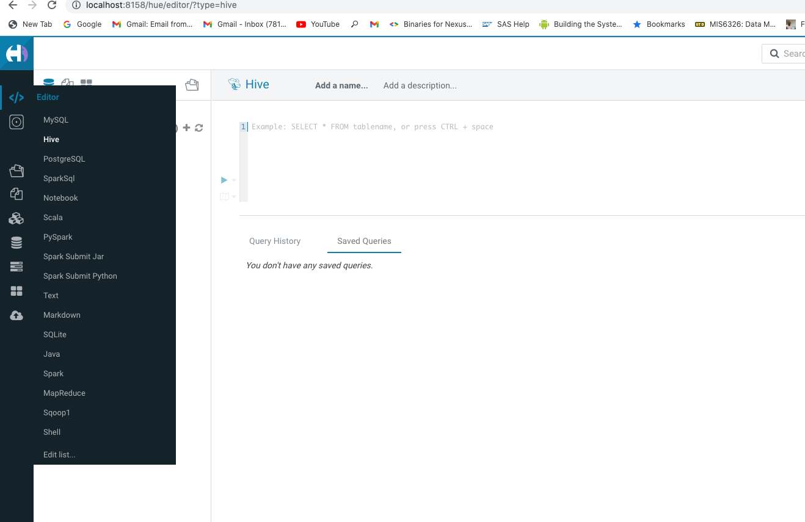

# **Apache Hive and Presto on EMR**

In this section we are going to use Hive and Presto to run batch ETL jobs and adhoc queries.

### Hive ETLs

In AWS Web Console, Go to EMR Console -> EMR-Hive-HBaseOnS3



Login to the leader node of this cluster using Session Manager or SSH (Go to Hardware tab -> master fleet -> Click on the instance ID -> Go to EC2 console -> Connect with Session Manager). Run the following command:

```
cd ~
sudo su hadoop
sudo -su hdfs hdfs dfs -chmod -R 777 /

```

Let's connect to Hue in this cluster to submit Hive queries. For this you will need to install [AWS CLI](https://docs.aws.amazon.com/cli/latest/userguide/getting-started-install.html) and [Session Manager plugin](https://docs.aws.amazon.com/systems-manager/latest/userguide/session-manager-working-with-install-plugin.html) on your local desktop to do this.

Replace the environmental variables with the values from the Team Dashboard. Run the below commands in your local desktop. For Windows, you will need to use "set" instead of "export".



```
export AWS_DEFAULT_REGION=us-east-1
export AWS_ACCESS_KEY_ID=<redacted>
export AWS_SECRET_ACCESS_KEY=<redacted>
export AWS_SESSION_TOKEN=<redacted>

```

Run the below command on your local desktop. Replace --target with your leader node instance ID of the EMR cluster in the following command.

```
aws ssm start-session --target i-054c79edd2456227b --document-name AWS-StartPortForwardingSession --parameters '{"portNumber":["8888"], "localPortNumber":["8158"]}' --region us-east-1

```



It should start a session on Hue port (8888). Go to the your browser and type *http://localhost:8158* in the address bar. You should now be taken to the Hue console.


Login to Hue by. You can choose any user name and password you like. Click "Create account". Once you are logged in, you will see Hue editor.



By default, it goes to MySQL editor. Click on this icon  on the top left corner and choose Hive editor.



Now we can run some Hive queries. Copy the below contents into Hue editor. Run these queries on Hue one at a time. REPLACE your account ID in S3 location wherever instructed.

```
CREATE TABLE `lineitem`(
  `l_orderkey` string,
  `l_partkey` bigint,
  `l_suppkey` string,
  `l_linenumber` bigint,
  `l_quantity` bigint,
  `l_extendedprice` double,
  `l_discount` double,
  `l_tax` double,
  `l_returnflag` string,
  `l_linestatus` string,
  `l_shipdate` string,
  `l_commitdate` string,
  `l_receiptdate` string,
  `l_shipinstruct` string,
  `l_shipmode` string,
  `l_comment` string)
ROW FORMAT DELIMITED
  FIELDS TERMINATED BY '|'
STORED AS INPUTFORMAT
  'org.apache.hadoop.mapred.TextInputFormat'
OUTPUTFORMAT
  'org.apache.hadoop.hive.ql.io.HiveIgnoreKeyTextOutputFormat'
LOCATION
  's3://redshift-downloads/TPC-H/10GB/lineitem/';


  CREATE EXTERNAL TABLE `orders`(
    `o_orderkey` bigint,
    `o_custkey` bigint,
    `o_orderstatus` string,
    `o_totalprice` double,
    `o_orderdate` string,
    `o_orderpriority` string,
    `o_clerk` string,
    `o_shippriority` bigint,
    `o_comment` string)
  ROW FORMAT DELIMITED
    FIELDS TERMINATED BY '|'
  STORED AS INPUTFORMAT
    'org.apache.hadoop.mapred.TextInputFormat'
  OUTPUTFORMAT
    'org.apache.hadoop.hive.ql.io.HiveIgnoreKeyTextOutputFormat'
  LOCATION
    's3://redshift-downloads/TPC-H/10GB/orders/';

  select l_quantity * (o_totalprice + l_extendedprice + l_tax - l_discount) as finalprice
  from lineitem join orders
  where l_receiptdate > 1992-01-03
  and o_orderpriority in ('1-URGENT','2-HIGH',')
  order by 1 desc
  limit 5;

  drop table lineitemorders

  -- REPLACE your account ID in S3 location

CREATE EXTERNAL TABLE `lineitemorders`(
  `orderkey` string,
  `linenumber` bigint,
  `quantity` bigint,
  `totalprice` double,
  `extendedprice` double,
  `tax` double,
  `discount` double,
  `orderpriority` string,
  `shippriority` bigint)
PARTITIONED BY (linestatus string)
CLUSTERED BY (orderkey)
SORTED BY (orderkey ASC)
INTO 10 BUCKETS
STORED AS PARQUET
LOCATION 's3://mrworkshop-youraccountID-dayone/hive/lineitemorders/';

set hive.exec.dynamic.partition=true;  
set hive.exec.dynamic.partition.mode=nonstrict;

insert overwrite table lineitemorders
partition (linestatus = 'O')
select o_orderkey,
l_linenumber
l_quantity,
o_totalprice,
l_extendedprice,
l_tax,
l_discount,
o_orderpriority,
o_shippriority,
o_orderdate as orderdate
from lineitem join orders
on l_orderkey = o_orderkey
where l_linestatus = 'O';

select * from lineitemorders limit 5;


select quantity * (totalprice + extendedprice) as finalprice, orderpriority
from lineitemorders
where linestatus = 'O'
group by orderpriority, quantity, totalprice, extendedprice, tax, discount
order by 1 desc
limit 5;

```

We can submit a parameterized Hive step to EMR cluster. Run the below command on your EMR leader node session. 

```
accountID=$(aws sts get-caller-identity --query Account --output text)
clusterID=$(cat /mnt/var/lib/info/job-flow.json | jq -r ".jobFlowId")

aws emr add-steps --cluster-id $clusterID --steps Type=Hive,Name="Hive Job",ActionOnFailure=CONTINUE,Args=[-f,s3://elasticmapreduce/samples/hive-ads/libs/response-time-stats.q,-d,INPUT=s3://elasticmapreduce/samples/hive-ads/tables,-d,OUTPUT=s3://mrworkshop-$accountID-dayone/hive-ads/output/,-d,SAMPLE=s3://elasticmapreduce/samples/hive-ads/]

```

aws emr add-steps --cluster-id j-30Q6UZV8FU5RN --steps Type=Hive,Name="Hive Job",ActionOnFailure=CONTINUE,Args=[-f,s3://elasticmapreduce/samples/hive-ads/libs/response-time-stats.q,-d,INPUT=s3://elasticmapreduce/samples/hive-ads/tables,-d,OUTPUT=s3://mrworkshop-475742350974-dayone/hive-ads/output/,-d,SAMPLE=s3://elasticmapreduce/samples/hive-ads/]


Hive also supports ACID tables.

Simba provides [JDBC drivers](https://docs.aws.amazon.com/emr/latest/ReleaseGuide/HiveJDBCDriver.html) for Hive and Presto to connect from BI tools like Tableau or SQL Workbench.

### S3DistCp Utility

Hive is typically used for batch ETL transformations. Presto is used for adhoc/interactive querying.

For flat copy (copying files without applying any transformations), it is always better to use S3-Dist-Cp than using Hive insert overwrite queries. Before we use Hive and Presto for querying, lets use S3-Dist-Cp utility to migrate CSV data and convert it into Parquet format.

Run the below two commands on EMR leader node.

```
sudo su hadoop
cd ~

s3-dist-cp --src  s3://redshift-downloads/TPC-H/3TB/lineitem/ --dest /user/hadoop/lineitem
s3-dist-cp --src  s3://redshift-downloads/TPC-H/3TB/orders/ --dest /user/hadoop/orders

```
Now, lets
