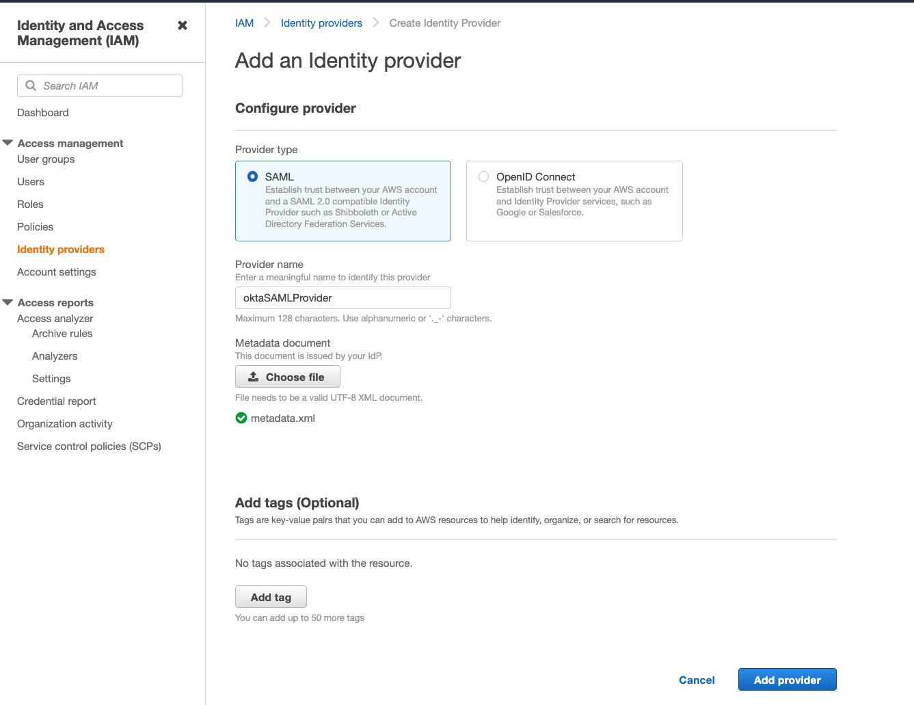
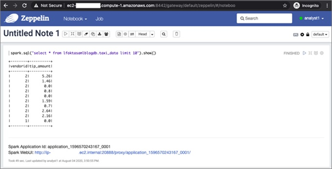

# **Fine-grained Authorization with LakeFormation Integration**

In this exercise you will integrate LakeFormation with EMR for fine-grained access control.

### Setup Okta IdP

For this lab, you will create an Okta account with your business email. It is free to create. This is the [sign up page](https://developer.okta.com/signup/).

Once you create the account and login, this is how the page will look like.


From the left hand side pane, go to Directory -> People -> Add person.

Add the following users:

Analyst One – analyst1@dsar.com
Analyst Two – analyst2@dsar.com

For Password, choose Set by admin and enter a valid password. Deselect the option User must change password on first login. Choose Save.


Once user is created, click on the user name and go to Profile tab. Edit the profile attributes for the newly created users to specify the Display name as analyst1 and analyst2 respectively. **Do not specify @dsar.com in the Display name field**.


Again from the left hand side pane, go to Applications -> Applications.

Choose Create App Integration and choose SAML 2.0. Click Next.


In App name, provide a friendly name for your application. For eg: lfemrapp. Go to next.

Enter following values in the next section. Replace youraccountID with your AWS event engine account ID in the two IAM ARNs in the Value column of 3rd row. Be careful to not add any extra trailing whitespaces.

| # |	Section	| Name |	Value |
| --- | ------ | ------ | ------ |
| 1 |	General	| Single Sign-On URL |	https://public-dns:8442/gateway/knoxsso/api/v1/websso?pac4jCallback=true&client_name=SAML2Client |
| 2 |	General	| Audience URI (SP Entity ID)|	urn:amazon:webservices |
| 3 |	Attribute Statements|	https://aws.amazon.com/SAML/Attributes/Role	| arn:aws:iam::youraccountID:role/LF-SAML-Role-emr-lf-saml,arn:aws:iam::youraccountID:saml-provider/oktaSAMLProvider |
| 4 |	Attribute Statements|	https://aws.amazon.com/SAML/Attributes/RoleSessionName |	user.displayName |
| 5 |	Attribute Statements|	https://glue.amazon.com/SAML/Attributes/UserName |	user.displayName |

Filled out form with above values looks like below.


Go to Next. Choose "I'm an Okta customer adding an internal app".


Click Finish. Your application will now be created and will be in active state.


Now go the Assignments tab (last tab in the above screenshot) to assign analyst1 and analyst2 to this newly created application. **Do not specify @dsar.com in the User Name field when assigning people to the application.**.

Click on Assign -> Assign to People.


Click on Assign next to analyst 1 and analyst 2 users. Remove the @dsar.com for both users. **Do not specify @dsar.com in the User Name field when assigning people to the application.**.


Save and go back. Once both users are in Assigned state, click Done.

Now go to Sign On tab. Under Sign On Methods, choose the link location for the IdP metadata file (right-click) and choose Copy Link Address.


It should look like: https://dev-<oktaaccountid>.okta.com/app/<randomString>/sso/saml/metadata

Also, save this metadata to your local desktop. (Right click -> Save File). Type .xml as extension.


<!--
### Create Identity Provider

Go to IAM Web Console -> Identity Providers -> Add Provider

Choose SAML. Provider name is oktaSAMLProvider. In the Metadata document, upload the file you downloaded in the previous step (metadata.xml).



Click on Add Provider. -->

### Set up Lake Formation

In your AWS Web Console (event engine), go to the [S3 Console](https://s3.console.aws.amazon.com/s3/bucket/create?region=us-east-1) and create a bucket with the name "s3://mrworkshop-youraccountID-lf" in us-east-1 region. You can leave all other S3 settings defaulted.


OR if you are logged in to the [EC2 instance](https://us-east-1.console.aws.amazon.com/ec2/v2/home?region=us-east-1#Instances:v=3;search=:jumphost) "JumpHost" via Session Manager, you can run the following commands to create a new bucket in us-east-1 region.

```
accountID=$(aws sts get-caller-identity --query "Account" --output text)
aws s3 mb s3://mrworkshop-$accountID-lf --region us-east-1

```

In your AWS Web Console (event engine), go to the AWS Lake Formation Console. Once you go to the console, the screen will look like below.


Click Get Started.

In left side pane, under Data catalog, choose Settings. For Data catalog settings, deselect the two permissions check-boxes. Choose Save.


In left side pane, go to Permissions -> Administrative roles and tasks. In Database creators section, click on Revoke. Under IAM users and roles, type IAMAllowedPrincipals and select it from drop down. Select "Create Database" and click "Revoke".


Now, choose Data catalog -> Databases from the left navigation pane. Choose Create database.

Database name: lfoktasamlblogdb

For Location, enter S3 path with your account ID replaced -> s3://mrworkshop-youraccountID-dayone/lf/


Click Create Database.

###  Launch Cloudformation Stack

Now, launch the [CloudFormation Stack](https://console.aws.amazon.com/cloudformation/home?region=us-east-1#/stacks/create/template?stackName=emr-lf-saml&templateURL=https://vasveena-test-demo.s3.amazonaws.com/template/emr-lf-saml.json) (Right click -> Open Link in New Tab).

Provide following parameters. Replace youraccountID with your AWS event engine account ID.

| Parameter | Value |
| -------- | ------ |
|StackName | emr-lf-saml |
|userBucketName | s3://mrworkshop-youraccountID-dayone/ |
|OktaAppMetadataURL | metadata URL we copied from the Okta console |
|SAMLProviderName | oktaSAMLProvider |
|Realm | EC2.INTERNAL |
|KdcAdminPassword | Test123$ |
|ReleaseLabel | emr-5.31.0 |
|InstanceType | c4.xlarge |
|VPCSubnet | Choose MMPublicSubnetOne |
|myIPCidr | 0.0.0.0/0 |
|oktaUser1 | analyst1 |
|oktaUser2 | analyst2 |
|EC2KeyPair | ee-default-keypair |

Screenshot of filled values:


Click on Next two times. Then check "I acknowledge that AWS CloudFormation might create IAM resources with custom names." and click "Create Stack".  


The stack will take about 15 minutes to get created.

Once the stack is created, in the Outputs tab of the Cloud Formation console, make a note of the primary DNS, SAML role ARN, and IdP ARN.

Go back to your Okta page. Go to General tab under application. Update the attributes.

### Validate the solution

Launch a web browser in incognito mode and open a Zeppelin notebook using the URL https://<EMR primary DNS>:8442/gateway/default/zeppelin/ (replace <EMR primary DNS> with the master node public DNS of the EMR cluster obtained from Cloudformation Output).

The Single Sign-On login page appears. Okta validates the login credentials with the system of record, like Active Directory, and returns a SAML, which is parsed and the next page is displayed based on the redirect URL parameter.

Log in to Zeppelin as analyst1.


After login, choose Create a note and run this SQL statement:

```
spark.sql("select * from lfoktasamlblogdb.taxi_data limit 10").show()

```

The following screenshot shows that analyst1 can only see the two columns that you specified in Lake Formation.



Open another web browser in incognito mode and log in to Zeppelin as analyst2.


The same select query shows all the columns, as shown in the following screenshot.


