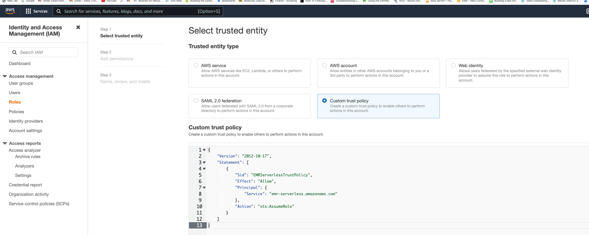
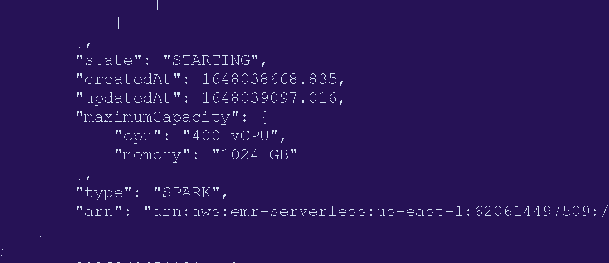

# **Amazon EMR Serverless**

In this exercise, you will run Hive and Spark applications using EMR Serverless.

To run the exercises in this section, you need to use your own AWS account. Since the feature is still in preview (as of writing this), you will not be charged. However, your AWS account should have been whitelisted for using EMR Serverless feature to be able to run these exercises.

If your AWS account is not whitelisted yet, you can sign up for preview of this feature using this [sign up](https://pages.awscloud.com/EMR-Serverless-Preview.html) form. Once your AWS account is whitelisted, you can come back to this exercise and run them. Since you are using your own AWS accounts, you can run this exercise even after the workshop.

You will need latest version of AWS CLI and jq installed to run these exercises. Run all the commands in the terminal of your local desktop (or export your AWS credentials and run them in an EC2 instance).

Let's first create an IAM role that we are going to use for job submission.

Go to [IAM Web Console](https://us-east-1.console.aws.amazon.com/iamv2/home#/roles) (Right click -> Open Link in New Tab) -> Create Role.

Under "Select Trusted Entity", choose "Custom Trust Policy" and paste the following:

```
{
    "Version": "2012-10-17",
    "Statement": [
        {
            "Sid": "EMRServerlessTrustPolicy",
            "Effect": "Allow",
            "Principal": {
                "Service": "emr-serverless.amazonaws.com"
            },
            "Action": "sts:AssumeRole"
        }
    ]
}

```



In the Permissions Policy section, choose a policy that will be used to access resources from your jobs. For time being, you can attach AdministratorAccess managed policy. But it is not recommended to do so other than for testing purpose. Always make sure to give the least privileges possible.

In next step, name your role. You can name this role "sampleJobExecutionRole".

Create the role.

### Spark on EMR Serverless

List the applications.

```
aws emr-serverless list-applications --region us-east-1

```

Create a new Spark application with min and and max limits for vCPU and memory.  

```
result=$(aws --region us-east-1 emr-serverless create-application \
    --release-label emr-6.5.0-preview \
    --type 'SPARK' \
    --initial-capacity '{
      "DRIVER": {
          "workerCount": 5,
          "resourceConfiguration": {
            "cpu": "2vCPU",
            "memory": "4GB"
          }
      },
      "EXECUTOR": {
        "workerCount": 50,
        "resourceConfiguration": {
            "cpu": "4vCPU",
            "memory": "8GB"
        }
      }
    }' \
    --maximum-capacity '{
     "cpu": "400vCPU",
     "memory": "1024GB"
   }' \
    --name spark-6.5.0-demo-application)

echo $result

appID=$(echo $result | jq -r .applicationId)

```

Now let's start this application.

```
aws --region us-east-1 emr-serverless start-application \
            --application-id ${appID}

```

You can get the status of the application with below command.

```
aws --region us-east-1 emr-serverless get-application \
            --application-id ${appID}

```

The state will be STARTING.



It will take about 1-2 minutes for the status to become STARTED.


Once the status becomes STARTED, lets submit a job to this application.

Get the ARN for the execution role you created. Also, create or use an existing S3 bucket in your own account in the same region where you are running these commands (us-east-1).

```
serverlessArn=$(aws iam get-role --role-name sampleJobExecutionRole | jq -r .'Role | .Arn')

s3bucket = 'yours3bucketname'

```

Let's use the following Spark code (same job we ran for EMR on EKS). You don't have to copy this script anywhere. This is just for your reference.

```
import sys
from datetime import datetime

from pyspark.sql import SparkSession
from pyspark.sql import SQLContext
from pyspark.sql.functions import *

if __name__ == "__main__":

    print(len(sys.argv))
    if (len(sys.argv) != 4):
        print("Usage: spark-etl-glue [input-folder] [output-folder] [dbName]")
        sys.exit(0)

    spark = SparkSession\
        .builder\
        .appName("Python Spark SQL Glue integration example")\
        .enableHiveSupport()\
        .getOrCreate()

    nyTaxi = spark.read.option("inferSchema", "true").option("header", "true").csv(sys.argv[1])

    updatedNYTaxi = nyTaxi.withColumn("current_date", lit(datetime.now()))

    updatedNYTaxi.printSchema()

    print(updatedNYTaxi.show())

    print("Total number of records: " + str(updatedNYTaxi.count()))

    updatedNYTaxi.write.parquet(sys.argv[2])

    updatedNYTaxi.registerTempTable("ny_taxi_table")

    dbName = sys.argv[3]
    spark.sql("CREATE database if not exists " + dbName)
    spark.sql("USE " + dbName)
    spark.sql("CREATE table if not exists ny_taxi_parquet USING PARQUET LOCATION '" + sys.argv[2] + "' AS SELECT * from ny_taxi_table ")

```

Submit the job using following command.

```

result=$(echo "aws --region us-east-1 emr-serverless start-job-run \
    --application-id ${appID} \
    --execution-role-arn ${serverlessArn} \
    --job-driver '{
        \"sparkSubmit\": {
          \"entryPoint\": \"s3://aws-data-analytics-workshops/emr-eks-workshop/scripts/spark-etl-glue.py\",
          \"entryPointArguments\": [
\"s3://aws-data-analytics-workshops/shared_datasets/tripdata/\",\"s3://$s3bucket/emrserverless/taxi-data-glue/\",\"tripdata\"
],
          \"sparkSubmitParameters\": \"--conf spark.executor.cores=1 --conf spark.executor.memory=4g --conf spark.driver.cores=1 --conf spark.driver.memory=4g --conf spark.executor.instances=1\"
                }
            }' \
    --configuration-overrides '{
      \"applicationConfiguration\": [{
  \"classification\": \"spark-defaults\",
  \"properties\": {
    \"spark.dynamicAllocation.enabled\": \"false\",
    \"spark.hadoop.hive.metastore.client.factory.class\": \"com.amazonaws.glue.catalog.metastore.AWSGlueDataCatalogHiveClientFactory\"
  }
}],
          \"monitoringConfiguration\": {
            \"s3MonitoringConfiguration\": {
              \"logUri\": \"s3://$s3bucket/emrserverless/logs\"
            }
          }
        }'" | bash )

```

Get the job run ID.

```
jobID=$(echo $result | jq -r .'jobRunId')

```

You can get the status of our job using the following command.

```
aws --region us-east-1 emr-serverless get-job-run \
      --application-id $appID \
      --job-run-id $jobID

```

You will see the job being scheduled.


Wait for the status to go from SCHEDULED to RUNNING to SUCCESS.


Now check the S3 location for logs and output. Download the stderr and stdout logs from Spark driver and inspect them.

```
aws s3 cp s3://$s3bucket/emrserverless/logs/applications/${appID}/jobs/${jobID}/SPARK_DRIVER/stderr.gz .
aws s3 cp s3://$s3bucket/emrserverless/logs/applications/${appID}/jobs/${jobID}/SPARK_DRIVER/stdout.gz .

```

You will see the job output in stdout and driver execution logs in stderr. Similarly, you can check out executor logs as well.

### Hive on EMR Serverless

EMR Serverless supports Hive applications also.

Let's start by creating a Hive application.

```

result=$(aws --region us-east-1 emr-serverless create-application \
    --release-label emr-6.5.0-preview \
    --initial-capacity '{
    "DRIVER": {
        "workerCount": 5,
        "resourceConfiguration": {
            "cpu": "2vCPU",
            "memory": "4GB"
        }
    },
    "TEZ_TASK": {
        "workerCount": 50,
        "resourceConfiguration": {
            "cpu": "4vCPU",
            "memory": "8GB"
        }
    }
  }' \
  --maximum-capacity '{
    "cpu": "400vCPU",
    "memory": "1024GB"
  }' \
  --type 'HIVE' \
  --name hive-6.5.0-demo-application)

  echo $result

  appID=$(echo $result | jq -r .applicationId)

```

Start the application.

```
aws --region us-east-1 emr-serverless start-application \
            --application-id ${appID}

```

Get application status.

```
aws --region us-east-1 emr-serverless get-application \
            --application-id ${appID}

```

Once the application status becomes STARTED, submit a Hive job.

For this, create a file called "hive-query.ql" with following contents:

```
create database if not exists emrserverless;
use emrserverless;
create table if not exists test_table(id int);
drop table if exists Values__Tmp__Table__1;
insert into test_table values (1),(2),(2),(3),(3),(3);
select id, count(id) from test_table group by id order by id desc;

```

Upload this file to an S3 location. You can use the same S3 bucket with a different prefix.

aws s3 cp hive-query.ql s3://$s3bucket/emrserverless/scripts/hive/

Now let's submit a Hive job to this application.

```
result=$(echo "aws --region us-east-1 emr-serverless start-job-run \
    --application-id ${appID} \
    --execution-role-arn ${serverlessArn} \
    --job-driver '{
        \"hive\": {
            \"query\": \"s3://$s3bucket/emr-serverless-hive/query/hive-query.ql\",
            \"parameters\": \"--hiveconf hive.root.logger=DEBUG,DRFA\"
        }
    }' \
    --configuration-overrides '{
        \"applicationConfiguration\": [{
           \"classification\": \"hive-site\",
               \"properties\": {
               \"hive.exec.scratchdir\": \"s3://$s3bucket/emr-serverless-hive/hive/scratch\",
               \"hive.metastore.warehouse.dir\": \"s3://$s3bucket/emr-serverless-hive/hive/warehouse\",
               \"hive.driver.cores\": \"2\",
               \"hive.driver.memory\": \"4g\",
               \"hive.tez.container.size\": \"4096\",
               \"hive.tez.cpu.vcores\": \"1\"
            }
            }
            ],
        \"monitoringConfiguration\": {
          \"s3MonitoringConfiguration\": {
            \"logUri\": \"s3://$s3bucket/emrserverless-hive/logs\"
          }
        }
      }'" | bash )

```

Get the job run ID.

```
jobID=$(echo $result | jq -r .'jobRunId')

```

You can get the status of our job using the following command.

```
aws --region us-east-1 emr-serverless get-job-run \
      --application-id $appID \
      --job-run-id $jobID

```

Look at the S3 stdout for results. Check the table in Glue catalog.

### Changing minor and major versions

Let's use a different Hive version for our application. Create a new application with release label 5.34.0-preview.

```

result=$(aws --region us-east-1 emr-serverless create-application \
    --release-label emr-5.34.0-preview \
    --initial-capacity '{
    "DRIVER": {
        "workerCount": 5,
        "resourceConfiguration": {
            "cpu": "2vCPU",
            "memory": "4GB"
        }
    },
    "TEZ_TASK": {
        "workerCount": 50,
        "resourceConfiguration": {
            "cpu": "4vCPU",
            "memory": "8GB"
        }
    }
  }' \
  --maximum-capacity '{
    "cpu": "400vCPU",
    "memory": "1024GB"
  }' \
  --type 'HIVE' \
  --name hive-6.5.0-demo-application)

  echo $result

  appID=$(echo $result | jq -r .applicationId)

```

Now let's submit the same Hive job to this application.

```
result=$(echo "aws --region us-east-1 emr-serverless start-job-run \
    --application-id ${appID} \
    --execution-role-arn ${serverlessArn} \
    --job-driver '{
        \"hive\": {
            \"query\": \"s3://$s3bucket/emr-serverless-hive/query/hive-query.ql\",
            \"parameters\": \"--hiveconf hive.root.logger=DEBUG,DRFA\"
        }
    }' \
    --configuration-overrides '{
        \"applicationConfiguration\": [{
           \"classification\": \"hive-site\",
               \"properties\": {
               \"hive.exec.scratchdir\": \"s3://$s3bucket/emr-serverless-hive/hive/scratch\",
               \"hive.metastore.warehouse.dir\": \"s3://$s3bucket/emr-serverless-hive/hive/warehouse\",
               \"hive.driver.cores\": \"2\",
               \"hive.driver.memory\": \"4g\",
               \"hive.tez.container.size\": \"4096\",
               \"hive.tez.cpu.vcores\": \"1\"
            }
            }
            ],
        \"monitoringConfiguration\": {
          \"s3MonitoringConfiguration\": {
            \"logUri\": \"s3://$s3bucket/emrserverless-hive/logs\"
          }
        }
      }'" | bash )

```

Get the job run ID.

```
jobID=$(echo $result | jq -r .'jobRunId')

```

You can get the status of our job using the following command.

```
aws --region us-east-1 emr-serverless get-job-run \
      --application-id $appID \
      --job-run-id $jobID

```

Once it finishes, check the stdout log in S3 for results and check the Glue catalog.
