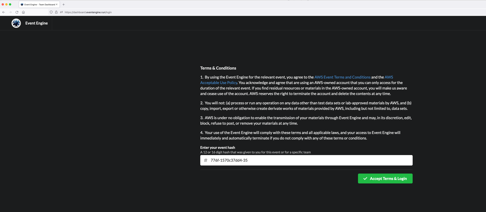
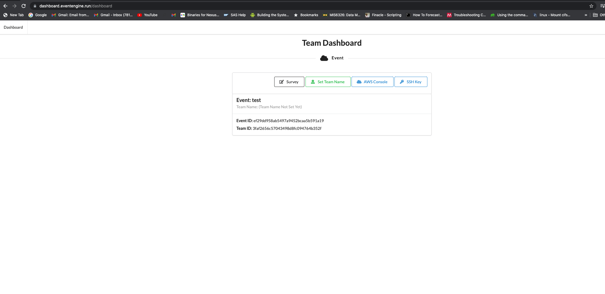
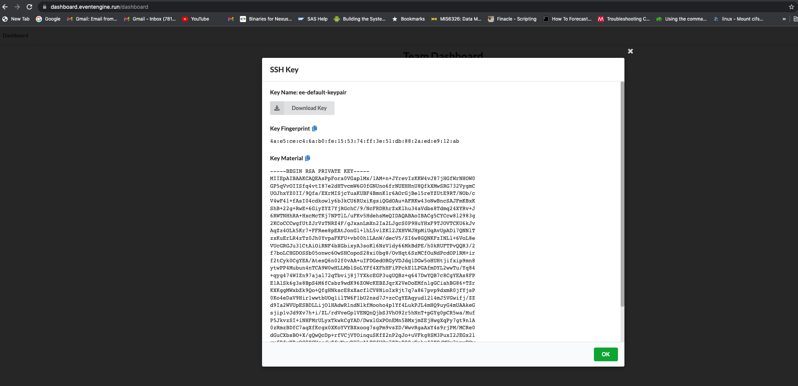
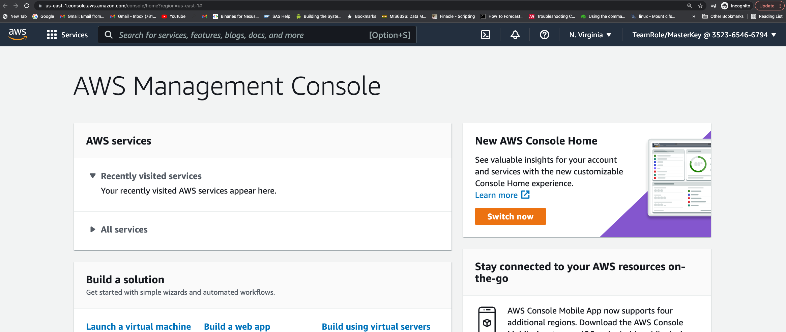
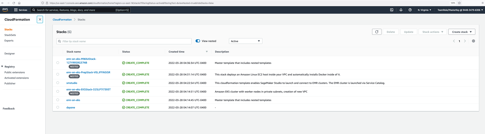

# ** Setup **

Perform the following steps to login to the event engine.

1. Type Event Engine URL on to your browser. (Right click [this](https://dashboard.eventengine.run/login) link -> Open in new tab).
2. Enter the hash provided to you. Accept Terms & Login.

3. Choose “Email One-Time Password”. Provide your email ID where your 9-digit OTP will be sent within 5 mins.

4. Once you receive OTP over your email, enter it to sign in to the Team Dashboard.

5. Click on the SSH Key and download the key to your local desktop. Click Ok once done.

6. Click on AWS Console and Open AWS Console. You can also retrieve AWS_DEFAULT_REGION, AWS_ACCESS_KEY_ID, AWS_SECRET_ACCESS_KEY and AWS_SESSION_TOKEN from this Team Dashboard whenever required for your exercises.

7. Make a note of your account ID in the top right corner of the AWS Console and store it in a notepad.

8. Go to CloudFormation and verify that the Cloudformation templates "dayone", "emr-on-eks" and "smstudio" are created.

